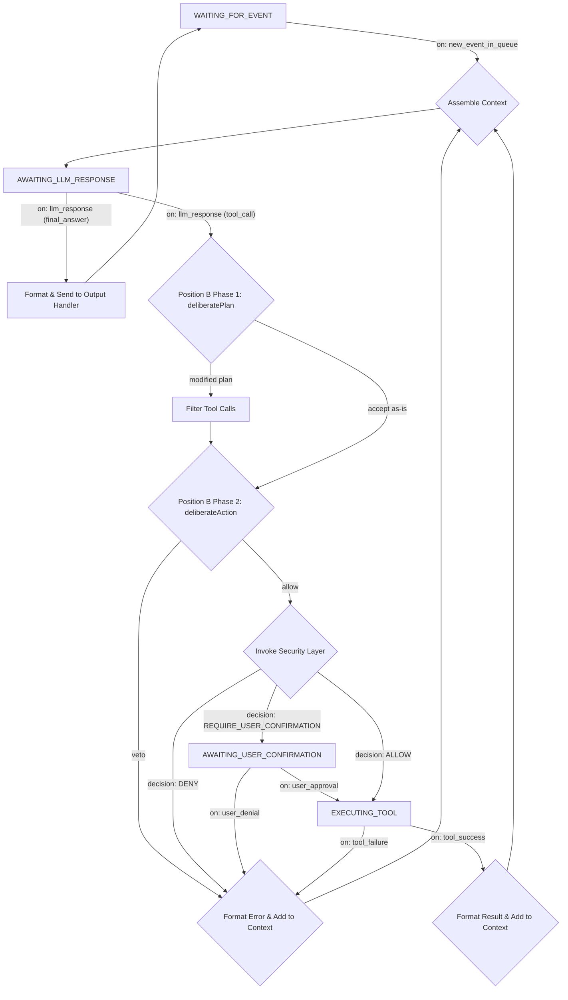

<!-- Layer: 1-Engineering -->

# 深度解析：LLM 驅動的執行循環

本文件深入探討精煉後的「執行循環」的設計。在新的架構中，執行循環的職責被進一步簡化，使其更加健壯和專一。

## 核心職責

執行循環是一個**異步的、單線程的循環**，它的**唯一職責**是：**從「內部事件隊列 (Internal Event Queue)」中獲取一個事件，並完成對該事件的處理**。它不關心事件的來源，只關心事件的內容。

---

## 狀態機視圖與流程

狀態機的入口變得更加統一，所有外界的刺激都首先被轉化為隊列中的一個事件。



### 關鍵變化

*   **統一的起點:** 原來的 `WAITING_FOR_USER_INPUT` 狀態變成了 `WAITING_FOR_EVENT`。循環的啟動不再依賴於特定的輸入類型。
*   **事件驅動:** 整個流程由 `on: new_event_in_queue` 觸發。事件的 `payload` 中會包含具體的內容，例如 `{ "source": "ui", "type": "user_input", "data": "你好" }` 或 `{ "source": "mcp_bus", "type": "mcp_message", "data": { "action": "..." } }`。
*   **輸出處理:** 原來的 `Send to UI` 變成了更通用的 `Send to Output Handler`。核心會根據原始事件的 `source`，將最終響應發回給正確的渠道（例如，通過 UI 插件的接口，或通過 MCP 的 `Tool`）。

---

## 關鍵實現細節

### 1. 上下文打包 (Context Assembly)
此步驟的核心不變，但現在「最新輸入」的來源是事件的 `payload`。
*   **系統提示 (System Prompt)**
*   **對話歷史 (Conversation History)**
*   **可用工具定義 (Tool Definitions)**
*   **最新事件內容 (Latest Event Payload):** 循環會將事件的 `payload` 格式化為一段文本（例如 "收到來自 [source] 的 [type] 類型消息，內容為：..."），作為 LLM 需要處理的最新輸入。

### 2. 錯誤處理
錯誤處理機制維持不變，依然是確保循環健壯性的關鍵。LLM 調用失敗或工具執行失敗都應被捕獲，並作為信息反饋給 LLM，以尋求自我修復。

---

## IVolition Position B — 雙階段審議 (Plan26, 2026-02-28)

Plan26 在 ExecutionLoop 中插入了 **Position B**（LLM 回應後、工具執行前），實現 IVolition 雙階段審議機制。

### 插入位置

```
LLM Response (tool_use stop reason)
  ↓ emit assistant message
  ↓
━━━ Position B Phase 1: deliberatePlan() ━━━
  ↓ 批量審議所有 pending tool calls
  ↓ 若 modifiedPlan ≠ null → 過濾 pendingToolCalls
  ↓ emit VOLITION_DELIBERATION 事件
  ↓
for each tool call:
  ━━━ Position B Phase 2: deliberateAction() ━━━
    ↓ 逐一審議每個 tool call
    ↓ 若 veto=true → skip + emit VOLITION_VETO + continue
    ↓
  SafetyMonitor.postCheck()
  ↓
  Tool Execution
  ↓
```

### ExecutionLoopDeps 擴展

```typescript
volition?: {
  deliberatePlan(input: PlanDeliberationInput): Promise<PlanDeliberationResult>;
  deliberateAction(input: ActionDeliberationInput): Promise<ActionDeliberationResult>;
  getKleshaSignals(sessionId?: string): KleshaSignalBundle;
  getVedanaAssessment(sessionId?: string): VedanaAssessment;
};
```

此欄位為 **optional**：無 volition 時行為與原先完全一致（向後相容）。

### 相關事件

| 事件 | 時機 |
|------|------|
| `VOLITION_DELIBERATION` | Phase 1 完成後（含 reasoning + modified flag） |
| `VOLITION_VETO` | Phase 2 否決工具時（含 action name + reasoning + alternative） |

### 參考文件

- SDK 類型定義：`@openstarry/sdk` → `types/volition.ts`
- R3 Debate 4 決議：`Architecture_Documentation/38_IVolition_Deliberation_Pattern.md`
- Klesha 增益排程：`Architecture_Documentation/37_Klesha_Gain_Scheduling.md`