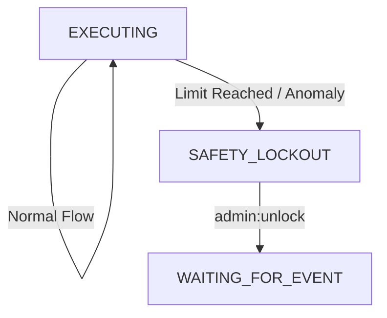

# 15. 安全熔斷機制與失控防禦 (Safety Circuit Breakers)

本文件定義了 OpenStarry 系統的多層次安全防禦體系，旨在防止代理人因 LLM 幻覺、邏輯死鎖或惡意輸入而陷入資源耗盡或危險操作的失控狀態。

設計遵循 **「分層防禦 (Defense in Depth)」** 原則，防禦措施由內而外，從核心邏輯到人類干預。

---

## Level 1: 資源級熔斷 (Resource Limits)
*目標：防止API費用爆炸與系統資源耗盡。*

這些限制是硬性的計數器，通常由 **`State Manager`** 或 **`Budget Manager Plugin`** 強制執行。

### 1.1 Token 預算 (Token Budget)
*   **機制：** 每個代理人實例在啟動時分配一個 `MAX_TOKEN_USAGE` (例如 100k tokens)。
*   **執行：** 每次調用 LLM Provider 前，檢查累計消耗。
*   **動作：** 一旦超限，強制終止思考循環，發送「預算耗盡」信號並進入 `STOPPED` 狀態。

### 1.2 循環次數上限 (Loop Cap)
*   **機制：** 限制單個任務 (Task) 內 `Execution Loop` 的最大迭代次數 (例如 50 次)。
*   **執行：** 核心維護 `tick_index`。
*   **動作：** 超過閾值，視為「任務陷入無限循環」，強制暫停並請求人類介入。

---

## Level 2: 行為級熔斷 (Behavioral Analysis)
*目標：檢測並中斷「無效的重複嘗試」或「發瘋」。*

這部分邏輯較為複雜，由 **Core 內部的啟發式算法** 實現。

### 2.1 重複工具調用檢測 (Repetitive Tool Call Detection)
*   **場景：** LLM 嘗試讀取一個不存在的文件，報錯，然後它無視錯誤，繼續嘗試讀取同一個文件，無限循環。
*   **機制：** 核心維護一個 `ToolCallFingerprint` 歷史隊列 (Hash of ToolName + Args)。
*   **規則：** 如果連續 `N` 次 (例如 3 次) 調用產生了相同的指紋且結果為失敗 (Error)，觸發熔斷。
*   **動作：** 強制向 Context 中插入一條系統級指令：*"SYSTEM ALERT: You are repeating a failed action. STOP and analyze why."* 若再次失敗，則終止代理人。

### 2.2 錯誤級聯熔斷 (Error Cascade Breaker)
*   **場景：** 代理人連續產生無效的 JSON 輸出，或連續調用不存在的工具。
*   **機制：** 維護一個滑動窗口內的錯誤率 (例如：最近 10 次操作中有 8 次異常)。
*   **動作：** 觸發 `EMERGENCY_HALT`，將代理人狀態置為 `ERROR_PAUSED`，等待開發者檢查。

---

## Level 3: 指令級熔斷 (Human Override)
*目標：確保人類擁有絕對的、即時的控制權。*

這是透過 **`Priority Event Queue`** (詳見 01_Execution_Loop 改進) 實現的。

### 3.1 緊急停止信號 (Kill Switch)
*   **機制：** 用戶或管理員發送 `SYSTEM_HALT` 或 `STOP` 指令。
*   **執行：**
    *   該指令被標記為 **Priority 0 (最高優先級)**。
    *   **核心執行循環** 在每次迭代開始時，**優先檢查** 高優先級隊列。
    *   即使隊列中還有 100 個待處理的普通任務，核心也會直接處理 Halt 指令。
*   **動作：** 立即丟棄當前正在準備的 LLM 請求，不執行任何後續工具，將狀態切換為 `STOPPED`，並清除事件隊列中的剩餘任務。

---

## 架構實現：`SafetyMonitor` 組件

為了保持核心整潔，建議將上述 Level 1 和 Level 2 的邏輯封裝在一個 **`SafetyMonitor`** 模塊中。

*   **位置：** `Agent Core` 的內部模塊 (非插件，因為它是基礎安全保障)。
*   **Hook 點：**
    *   `beforeLLMCall()`: 檢查 Token 預算。
    *   `afterToolExecution()`: 檢查重複調用和錯誤率。
    *   `onEventLoopStart()`: 檢查 Tick 上限。

> `[Cycle 02-4 參照]`: 研究團隊已統一 SafetyMonitor 方法命名——`isSafe()` (取代 beforeLLMCall)、`postCheck()` (工具執行後安全檢查)、`afterToolExecution()` (不變)。見 Architecture_Documentation/44_Safety_Architecture_Overview.md。

### 狀態機整合
當熔斷觸發時，狀態機從 `EXECUTING` 強制跳轉至 `SAFETY_LOCKOUT` 狀態。此狀態下，代理人拒絕執行任何任務，直到收到解鎖指令。

---

## 總結

這套熔斷機制確保了：
1.  **錢包安全:** 不會因為 Bug 燒光 API 額度。
2.  **系統穩定:** 不會因為無限循環佔用計算資源。
3.  **人類可控:** 無論代理人多忙，人類隨時可以按下暫停鍵。

---

<!-- Plan38 Multi-Agent Extension (v0.38.0-alpha) -->

## 多代理安全擴展 (Multi-Agent Safety Extensions)

Plan38 (v0.38.0-alpha) 將安全熔斷機制從單一代理擴展至多代理場景。多代理環境引入了新的攻擊面與故障模式，需要額外的安全防禦層。

### SEC-002: PID-to-agentId 身份驗證

**問題：** 在多代理環境中，訊息可能被偽造來源身份。代理人 A 可能冒充代理人 B 發送指令。

**機制：**
*   每個代理人行程 (process) 擁有唯一的 PID (Process ID)。
*   `SEC-002` 強制驗證訊息發送者的 PID 與其宣稱的 `agentId` 之間的綁定關係。
*   在代理人啟動並完成 `register` 時，系統記錄 `PID <-> agentId` 映射。
*   後續所有通訊操作均檢查此映射，不匹配則拒絕並記錄安全事件。

### SEC-003: 路徑穿越防護 (Path Traversal Prevention)

**問題：** 代理人可能透過工具調用嘗試存取超出其授權範圍的檔案路徑 (例如 `../../etc/passwd`)。

**機制：**
*   所有檔案系統操作在執行前進行路徑正規化 (canonicalization)。
*   驗證正規化後的路徑是否落在代理人被授權的目錄範圍內。
*   任何越界嘗試立即被阻擋，觸發安全告警。

### SEC-005: traceDepth 深度限制

**問題：** 在多代理委派鏈 (delegation chain) 中，代理人 A 委派 B，B 再委派 C，可能形成無限深度的委派鏈或循環委派。

**機制：**
*   每個訊息攜帶 `traceDepth` 計數器，每經過一次委派 +1。
*   當 `traceDepth` 超過設定上限時，拒絕進一步委派，強制返回失敗回應。
*   防止委派鏈爆炸導致的資源耗盡與系統不穩定。

### SEC-008: Metadata 大小限制

**問題：** 惡意或失控的代理人可能在訊息的 metadata 欄位中塞入超大數據，造成記憶體耗盡或網路擁塞。

**機制：**
*   對所有訊息的 metadata 欄位設定大小上限 (bytes)。
*   超過限制的訊息在 `CommRouter` 層被攔截並丟棄。
*   記錄違規事件以供事後審計。

### F-5: 權限晶格 (Permission Lattice)

Plan38 引入了三維權限晶格 (3-dimensional Permission Lattice)，為子代理人 (child agent) 提供細粒度的權限控制：

| 維度 | 說明 | 約束規則 |
| :--- | :--- | :--- |
| **路徑子集 (Path Subset)** | 子代理人可存取的檔案路徑範圍 | 必須是父代理人路徑權限的子集 (嚴格收窄) |
| **Token 預算 (Token Budget)** | 子代理人可消耗的最大 Token 數量 | 必須 <= 父代理人剩餘預算 |
| **信心天花板 (Confidence Ceiling)** | 子代理人工具執行的最高信心閾值 | 必須 <= 父代理人的信心上限 |

**核心原則：子代理人的權限在三個維度上都不得超越父代理人。** 這確保了權限只會隨委派鏈向下收窄 (monotonic narrowing)，從根本上防止了權限提升 (privilege escalation) 攻擊。

### 雙重速率限制 (Dual Rate Limiting)

為了防止通訊洪水 (message flooding) 攻擊或失控的訊息風暴：

| 限制類型 | 閾值 | 說明 |
| :--- | :--- | :--- |
| **Per-Agent (每代理人)** | 100 訊息/秒 | 限制單一代理人的發送速率，防止個體失控 |
| **Per-Target (每目標)** | 20 訊息/秒 | 限制對同一目標代理人的發送速率，防止定向轟炸 |

超過速率限制的訊息將被 `comm-proxy` 層丟棄，並向發送方返回 `failure` 回應 (FIPA ACL performative)。

### 7 步崩潰處理流程 (7-Step Crash Handling Flow)

當多代理環境中的代理人發生崩潰時，系統執行以下 7 步處理流程：

1.  **檢測 (Detection)：** Daemon 透過心跳 (heartbeat) 機制偵測到代理人行程無回應。
2.  **隔離 (Isolation)：** 立即將崩潰代理人從通訊頻道中移除 (`deregister`)，防止其他代理人向其發送訊息。
3.  **通知 (Notification)：** 向崩潰代理人的父代理人 (若有) 及所有活躍通訊對象發送 `failure` 通知。
4.  **狀態快照 (State Snapshot)：** 保存崩潰代理人最後已知的 `AgentSnapshot`（若 Save-After-Write 機制正常運作，此快照應已存在）。
5.  **佇列保護 (Queue Protection)：** 將發送給崩潰代理人的待處理訊息暫存至死信佇列 (Dead Letter Queue)，避免訊息丟失。
6.  **重啟嘗試 (Restart Attempt)：** Daemon 根據配置嘗試重啟代理人行程，並從最後快照恢復 (Hydration)。
7.  **重新註冊 (Re-registration)：** 重啟成功後，代理人重新 `register` 至通訊頻道，死信佇列中的訊息按序投遞。

> **當前實作狀態 (v0.59.6 誠實複核)：**
> - **第 1-2 步（檢測＋隔離）已落地**：`apps/channel/src/registry.ts` `startHeartbeatMonitor`（`consecutiveMisses` 達 `DEFAULT_HEARTBEAT_MISS_THRESHOLD` → `TERMINATED`）＋ `deregister`，於 `Channel.start()` 接線。
> - **第 3-7 步（通知／快照／佇列保護／重啟／重註冊）仍為 stub**（`apps/channel/src/crash-handler.ts` 步驟 3-6 僅 `logger.debug`）。**這不是「填空即可」，而是缺架構前提**：
>   - **死信佇列（佇列保護）**需要一個真實的訊息*緩衝*來保護，但 channel hub 不路由訊息、daemon 的 `PipelineChannel` 為**同步投遞**且**尚未於 production 被 instantiate**（`new PipelineChannel` 全 repo 0 命中，僅 reference/測試）——故 DLQ 目前**無生產者**，硬補將成「測試過但無人呼叫」的死碼。
>   - **重啟＋hydration（第 6 步）**需要真實的子進程監督與「真的會崩潰的子進程」整合測試。
>   - 兩者皆為**真實的後續工程**（需先建 async buffered delivery 與進程監督層），非本輪可誠實落地的小修；刻意不以死碼充數（見 RETROSPECTIVE／LETTER 對 96% 灌水的教訓）。
> 第 4 步（狀態快照）由既有 Save-After-Write（`snapshot-store`／`session-persistence`）部分支撐。

### 安全擴展與既有機制的整合

| 既有機制 | 多代理安全擴展 |
| :--- | :--- |
| Level 1 資源級熔斷 | + F-5 Permission Lattice (Token Budget 維度) |
| Level 2 行為級熔斷 | + 雙重速率限制 (per-agent / per-target) |
| Level 3 人類覆寫 | 不變；父代理人可對子代理人執行 Kill Switch |
| SafetyMonitor | + SEC-002/003/005/008 檢查點整合 |
| 狀態機 SAFETY_LOCKOUT | + 7 步崩潰處理流程 |
