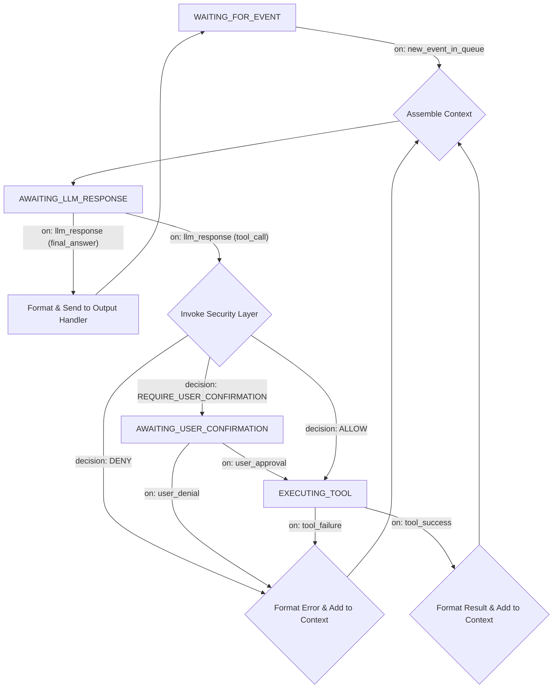

# 深度解析：LLM 驱动的执行循环

本文档深入探讨精炼后的「执行循环」的设计。在新的架构中，执行循环的职责被进一步简化，使其更加健壮和专一。

## 核心职责

执行循环是一个**异步的、单线程的循环**，它的**唯一职责**是：**从「内部事件队列 (Internal Event Queue)」中获取一个事件，并完成对该事件的处理**。它不关心事件的来源，只关心事件的内容。

---

## 状态机视图与流程

状态机的入口变得更加统一，所有外界的刺激都首先被转化为队列中的一个事件。

### 关键变化

*   **统一的起点:** 原来的 `WAITING_FOR_USER_INPUT` 状态变成了 `WAITING_FOR_EVENT`。循环的启动不再依赖于特定的输入类型。
*   **事件驱动:** 整个流程由 `on: new_event_in_queue` 触发。事件的 `payload` 中会包含具体的内容，例如 `{ "source": "ui", "type": "user_input", "data": "你好" }` 或 `{ "source": "mcp_bus", "type": "mcp_message", "data": { "action": "..." } }`。
*   **输出处理:** 原来的 `Send to UI` 变成了更通用的 `Send to Output Handler`。核心会根据原始事件的 `source`，将最终响应发回给正确的渠道（例如，通过 UI 插件的接口，或通过 MCP 的 `Tool`）。

---

## 关键实现细节

### 1. 上下文打包 (Context Assembly)
此步骤的核心不变，但现在「最新输入」的来源是事件的 `payload`。
*   **系统提示 (System Prompt)**
*   **对话历史 (Conversation History)**
*   **可用工具定义 (Tool Definitions)**
*   **最新事件内容 (Latest Event Payload):** 循环会将事件的 `payload` 格式化为一段文本（例如 "收到来自 [source] 的 [type] 类型消息，内容为：..."），作为 LLM 需要处理的最新输入。

### 2. 错误处理
错误处理机制维持不变，依然是确保循环健壮性的关键。LLM 调用失败或工具执行失败都应被捕获，并作为信息反馈给 LLM，以寻求自我修复。
