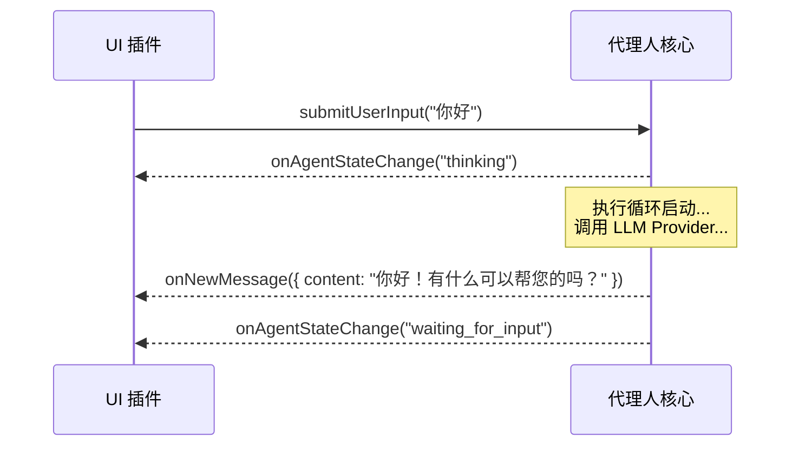
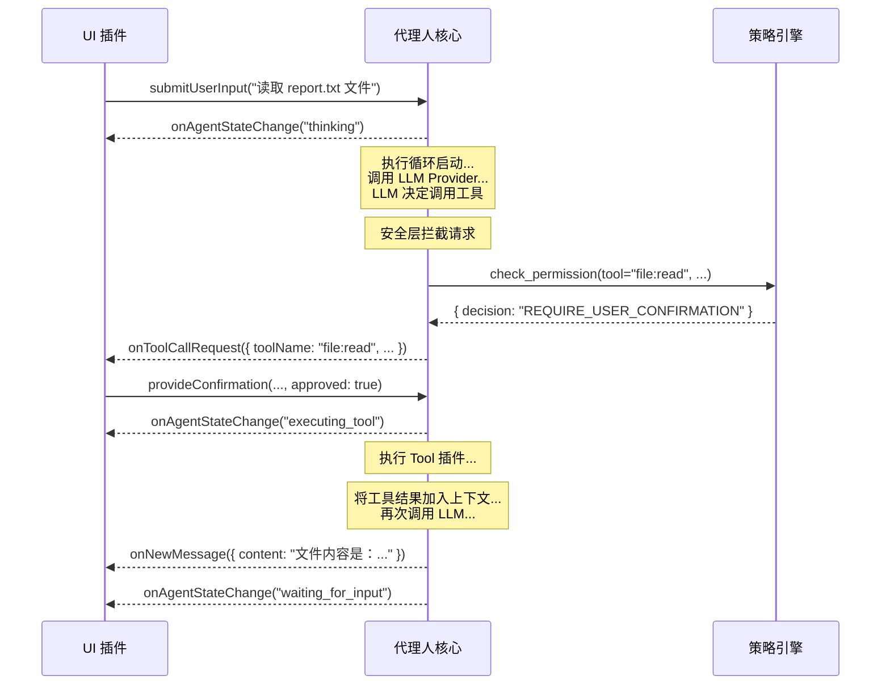

# 深度解析：双向通信接口

本文档深入探讨核心与 UI 插件之间的「神经系统」——双向通信接口的协议、事件和命令的具体定义。

## 设计原则

该接口遵循「事件驱动」和「命令模式」的设计，以实现核心与 UI 的最大程度解耦。核心广播事件，UI 响应事件来更新视图；UI 发送命令，核心响应命令来改变状态。

---

## 交互流程图 (Sequence Diagram)

### 场景一：简单问答


### 场景二：工具调用


---

## 接口详细定义

### 核心 -> UI 事件

*   **`onNewMessage(payload: object)`**
    *   **数据结构 (Payload):**
        ```json
        {
          "content": "string",
          "format": "markdown" | "text",
          "metadata": {
            "source_documents": [ /* RAG 结果 */ ],
            "latency_ms": 1200
          }
        }
        ```

*   **`onToolCallRequest(payload: object)`**
    *   **数据结构 (Payload):**
        ```json
        {
          "confirmationId": "uuid-1234",
          "toolName": "shell:execute",
          "args": { "command": "ls -l" },
          "security_warning": {
            "level": "CRITICAL" | "WARN" | "INFO",
            "message": "代理人正试图执行一个 Shell 命令..."
          }
        }
        ```

### UI -> 核心 命令

*   **`submitUserInput(payload: object)`**
    *   **数据结构 (Payload):**
        ```json
        {
          "text": "string",
          "attachments": [ // 用于支持多模态输入
            { "type": "image", "data": "base64-encoded-string" }
          ]
        }
        ```
*   **`provideConfirmation(payload: object)`**
    *   **数据结构 (Payload):**
        ```json
        {
          "confirmationId": "uuid-1234",
          "approved": true | false
        }
        ```
---

## 实现协议探讨 (Implementation Protocols)

*   **单体应用 (Monolithic):** 如果核心和 UI 在同一个进程中运行（例如，一个本地的桌面 TUI 应用），最简单的实现是使用语言内置的事件机制，如 Node.js 的 `EventEmitter`。核心是一个 EventEmitter 实例，UI 插件在初始化时对其进行监听。
*   **客户端/服务器 (Client/Server):** 如果 UI 是一个远程的 Web 应用或移动 App，则需要使用网络协议。
    *   **WebSocket:** 是理想的选择，因为它提供了持久的双向通信通道，核心可以随时向 UI 推送事件。
    *   **HTTP长轮询/SSE:** 作为备选方案，也可以实现实时的事件推送。

---

## Session 隔离架构 (Session Isolation Architecture)

> **状态：** 📋 规划中 (Plan05.1)

### 问题背景

目前的架构是「广播 (Broadcast)」模式。这意味着：如果用户 A 用 WebSocket 连接 Agent，同时用户 B 也连接，两人会看到彼此的消息和工具调用结果。这在单人使用时没问题，但在多人协作或多租户场景下是严重隐私漏洞。

### 解决方案

引入 Session 隔离机制，确保每个客户端只收到属于自己的消息。

```
┌─────────────┐     ┌─────────────┐     ┌─────────────┐
│ Client A    │     │ Client B    │     │ Client C    │
│ sessionId:A │     │ sessionId:B │     │ sessionId:C │
└──────┬──────┘     └──────┬──────┘     └──────┬──────┘
       │                   │                   │
       └───────────────────┼───────────────────┘
                           │
                    ┌──────▼──────┐
                    │   Listener  │
                    │ 标记sessionId │
                    └──────┬──────┘
                           │
                    ┌──────▼──────┐
                    │    Core     │
                    │ 透传sessionId │
                    └──────┬──────┘
                           │
                    ┌──────▼──────┐
                    │     UI      │
                    │ 依sessionId  │
                    │  过滤推送   │
                    └─────────────┘
```

### 实作思路

1. **Listener 层：** 接收输入时，标记 `sessionId`（例如 `ws-client-1`）
   ```typescript
   ctx.pushInput({
     source: "websocket",
     inputType: "user_input",
     data: msg.payload?.text ?? "",
     sessionId: clientId,  // 新增
     replyTo: clientId,
   });
   ```

2. **Core 层：** 处理时，将 `sessionId` 透传到输出事件
   ```typescript
   interface AgentEvent {
     type: AgentEventType;
     timestamp: number;
     payload: {
       sessionId?: string;  // 新增
       // ...其他字段
     };
   }
   ```

3. **UI 层：** 在 `onEvent` 中判断过滤
   ```typescript
   onEvent(event: AgentEvent): void {
     const sessionId = event.payload?.sessionId;

     if (sessionId && connections.has(sessionId)) {
       // 定向推送给特定客户端
       const conn = connections.get(sessionId)!;
       conn.ws.send(JSON.stringify(event));
     } else if (!sessionId) {
       // 系统广播（无 sessionId）推送给所有人
       for (const conn of connections.values()) {
         conn.ws.send(JSON.stringify(event));
       }
     }
   }
   ```

### 验收标准

- ☐ WebSocket 用户 A 看不到用户 B 的对话
- ☐ 系统广播（无 sessionId）所有用户都能收到
- ☐ 消息不会跨 Session 泄漏

### 与 MCP 协议的关系

**这是进入 Plan06 (MCP 整合) 的前置条件。**

MCP 协议场景中会有多个外部客户端同时连接 Agent。若无 Session 隔离：
- Client A 会看到 Client B 的工具调用结果
- 造成数据隐私泄漏
- 违反多租户安全原则
