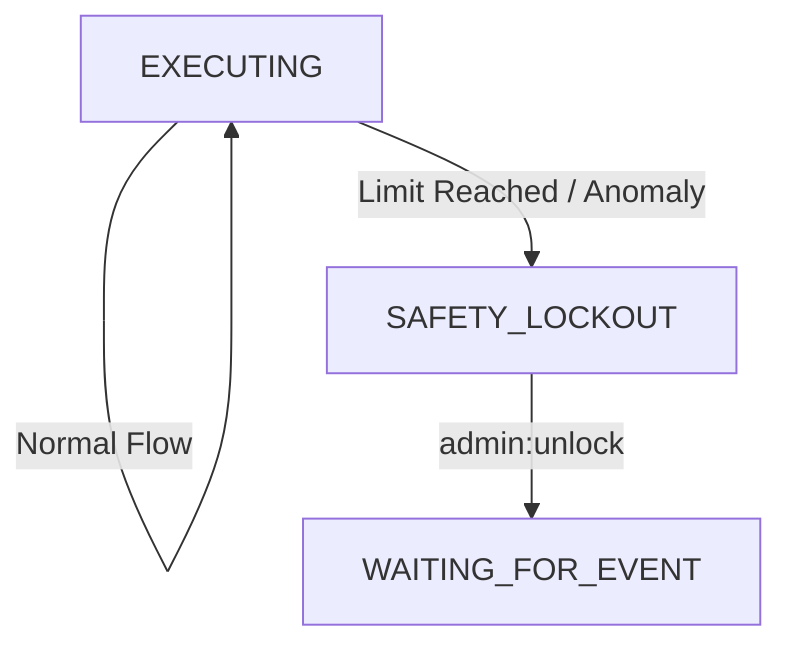

# 15. 安全熔断机制与失控防御 (Safety Circuit Breakers)

本文档定义了 OpenStarry 系统的多层次安全防御体系，旨在防止代理人因 LLM 幻觉、逻辑死锁或恶意输入而陷入资源耗尽或危险操作的失控状态。

设计遵循 **「分层防御 (Defense in Depth)」** 原则，防御措施由内而外，从核心逻辑到人类干预。

---

## Level 1: 资源级熔断 (Resource Limits)
*目标：防止 API 费用爆炸与系统资源耗尽。*

这些限制是硬性的计数器，通常由 **`State Manager`** 或 **`Budget Manager Plugin`** 强制执行。

### 1.1 Token 预算 (Token Budget)
*   **机制：** 每个代理人实例在启动时分配一个 `MAX_TOKEN_USAGE` (例如 100k tokens)。
*   **执行：** 每次调用 LLM Provider 前，检查累计消耗。
*   **动作：** 一旦超限，强制终止思考循环，发送「预算耗尽」信号并进入 `STOPPED` 状态。

### 1.2 循环次数上限 (Loop Cap)
*   **机制：** 限制单个任务 (Task) 内 `Execution Loop` 的最大迭代次数 (例如 50 次)。
*   **执行：** 核心维护 `tick_index`。
*   **动作：** 超过阈值，视为「任务陷入无限循环」，强制暂停并请求人类介入。

---

## Level 2: 行为级熔断 (Behavioral Analysis)
*目标：检测并中断「无效的重复尝试」或「发疯」。*

这部分逻辑较为复杂，由 **Core 内部的启发式算法** 实现。

### 2.1 重复工具调用检测 (Repetitive Tool Call Detection)
*   **场景：** LLM 尝试读取一个不存在的文件，报错，然后它无视错误，继续尝试读取同一个文件，无限循环。
*   **机制：** 核心维护一个 `ToolCallFingerprint` 历史队列 (Hash of ToolName + Args)。
*   **规则：** 如果连续 `N` 次 (例如 3 次) 调用产生了相同的指纹且结果为失败 (Error)，触发熔断。
*   **动作：** 强制向 Context 中插入一条系统级指令：*"SYSTEM ALERT: You are repeating a failed action. STOP and analyze why."* 若再次失败，则终止代理人。

### 2.2 错误级联熔断 (Error Cascade Breaker)
*   **场景：** 代理人连续产生无效的 JSON 输出，或连续调用不存在的工具。
*   **机制：** 维护一个滑动窗口内的错误率 (例如：最近 10 次操作中有 8 次异常)。
*   **动作：** 触发 `EMERGENCY_HALT`，将代理人状态置为 `ERROR_PAUSED`，等待开发者检查。

---

## Level 3: 指令级熔断 (Human Override)
*目标：确保人类拥有绝对的、即时的控制权。*

这是通过 **`Priority Event Queue`** (详见 01_Execution_Loop 改进) 实现的。

### 3.1 紧急停止信号 (Kill Switch)
*   **机制：** 用户或管理员发送 `SYSTEM_HALT` 或 `STOP` 指令。
*   **执行：**
    *   该指令被标记为 **Priority 0 (最高优先级)**。
    *   **核心执行循环** 在每次迭代开始时，**优先检查** 高优先级队列。
    *   即使队列中还有 100 个待处理的普通任务，核心也会直接处理 Halt 指令。
*   **动作：** 立即丢弃当前正在准备的 LLM 请求，不执行任何后续工具，将状态切换为 `STOPPED`，并清除事件队列中的剩余任务。

---

## 架构实现：`SafetyMonitor` 组件

为了保持核心整洁，建议将上述 Level 1 和 Level 2 的逻辑封装在一个 **`SafetyMonitor`** 模块中。

*   **位置：** `Agent Core` 的内部模块 (非插件，因为它是基础安全保障)。
*   **Hook 点：**
    *   `beforeLLMCall()`: 检查 Token 预算。
    *   `afterToolExecution()`: 检查重复调用和错误率。
    *   `onEventLoopStart()`: 检查 Tick 上限。

### 状态机整合
当熔断触发时，状态机从 `EXECUTING` 强制跳转至 `SAFETY_LOCKOUT` 状态。此状态下，代理人拒绝执行任何任务，直到收到解锁指令。

---

## 总结

这套熔断机制确保了：
1.  **钱包安全:** 不会因为 Bug 烧光 API 额度。
2.  **系统稳定:** 不会因为无限循环占用计算资源。
3.  **人类可控:** 无论代理人多忙，人类随时可以按下暂停键。
