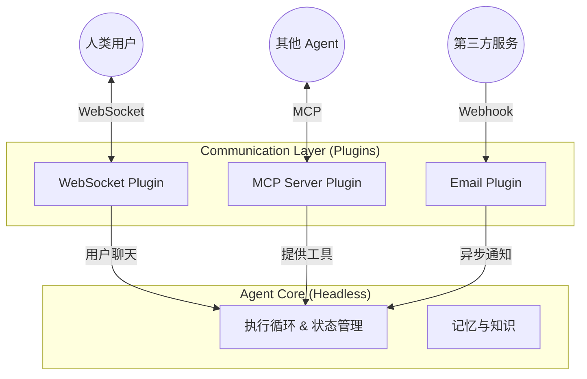

# 08. 通讯协议策略：多头并进的开放架构

本文档定义了 OpenStarry 系统中关于「通讯 (Communication)」的核心架构哲学。我们不强制绑定任何单一的传输协议，而是将通讯能力完全下放给插件层。

## 核心哲学：通讯即插件 (Communication as a Plugin)

在 OpenStarry 中，**Agent Core 是「协议中立 (Protocol Agnostic)」的**。核心只理解内部的「事件 (Events)」与「意图 (Intents)」，而不知道外部世界是通过什么方式与它沟通的。

所有的外部通讯——无论是与人类的聊天，还是与其他机器的协作——都必须通过**通讯插件 (Communication Plugin)** 来进行适配。

这种设计使得一个 Agent 可以成为「多头 (Multi-headed)」实体：它可以在同一时间，通过多种不同的渠道和协议，与不同的对象进行互动。

---

## 通讯插件的分类光谱

为了更好地治理多样化的通讯需求，我们将通讯插件分为两大类：

### 1. 渠道插件 (Channel Plugins) - 面向人类与业务
这类插件主要处理**非结构化或半结构化**的交互，通常模拟「对话 (Conversation)」。

*   **目标对象：** 人类用户、聊天机器人平台、通知系统。
*   **交互模式：** 
    *   **Inbound:** 将外部消息 (Text/Image) 转换为 `core.submitUserInput()`。
    *   **Outbound:** 监听 `onNewMessage` 事件，将其渲染为文本或卡片发送出去。
*   **典型范例：**
    *   **WebSocket / HTTP Server:** 用于 Web UI 或移动 App。
    *   **WhatsApp / Telegram / Discord Adapter:** 用于即时通讯软件。
    *   **Email Listener:** 通过邮件进行异步沟通。
    *   **Voice Interface:** 语音转文字 (STT) 与文字转语音 (TTS) 接口。

### 2. 协议插件 (Protocol Plugins) - 面向机器与能力
这类插件处理**高度结构化**的数据交换，通常模拟「远程过程调用 (RPC)」或「资源访问」。

*   **目标对象：** 其他 Agent、遗留系统、微服务、IDE、数据库。
*   **交互模式：** 
    *   **As Server (被调用):** 将外部请求映射为 `core.executeTool()` (直接执行能力) 或触发特定的系统指令。
    *   **As Client (主动调用):** 将 Agent 的 `Tool Call` 意图转换为特定的网络请求 (HTTP Request, MCP Packet, gRPC Call)。
*   **典型范例：**
    *   **MCP (Model Context Protocol):** **(推荐标准)** 用于标准化的工具互操作与资源共享。
    *   **REST API Adapter:** 将 Agent 暴露为一组 RESTful Endpoint。
    *   **ActivityPub:** 让 Agent 成为联邦宇宙 (Fediverse) 中的一个节点。
    *   **Custom Binary Protocol:** 用于高频交易或低延迟场景的专有协议。

---

## 多头代理人模型 (The Multi-headed Agent Model)

一个强大的 OpenStarry Agent 通常会同时加载多个通讯插件，形成「多头」形态：

### 场景示例：全能助理

一个「全能商务助理 Agent」可以这样配置：
1.  **WebSocket Plugin:** 连接用户的手机 App，让用户可以随时语音下指令。
2.  **MCP Client Plugin:** 连接公司的「数据库检索 MCP Server」，获取销售数据。
3.  **Slack Adapter Plugin:** 加入公司的 Slack 工作群，监听同事的 `@mention` 并自动回复。

在这个场景中，Core 不需要知道它正在同时处理 WebSocket、MCP 和 Slack 三种协议。它只是不断地接收 `Input`，思考，然后产生 `Output`。是各个插件负责将这些 Output 分发回正确的渠道。

---

## MCP 的特殊地位

虽然我们支持多种协议，但我们将 **MCP (Model Context Protocol)** 视为生态系统中的**一等公民 (First-class Citizen)**。

*   **为什么？** 因为 MCP 专门为 AI 时代设计，解决了「Prompt 长度限制」和「上下文动态加载」的问题，这是传统 REST 或 WebSocket 难以优雅解决的。
*   **策略：** 我们推荐使用 MCP 作为 Agent 之间 (Agent-to-Agent) 以及 Agent 与工具之间 (Agent-to-Tool) 的预设标准，但绝不强制。详情请参阅 `../Plugin_Infrastructure_Examples/02_MCP_Protocol_Integration.md`。