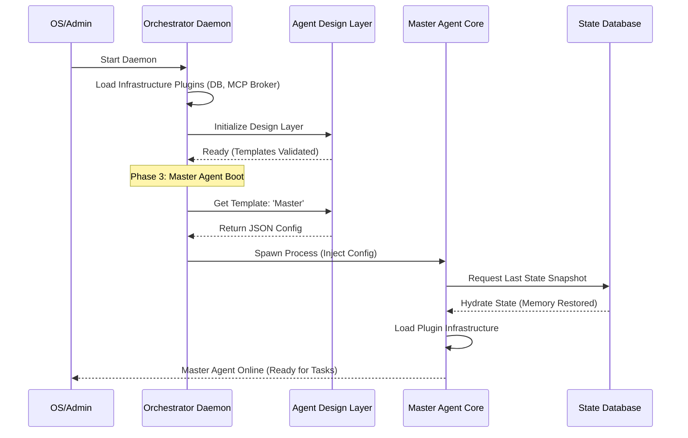

# 13. 系统启动顺序与引导逻辑 (System Boot Sequence)

本文档定义了 OpenStarry 系统中「守护层 (Daemon)」、「设计层 (Design Layer)」与「核心层 (Agent Core)」在冷启动与运行时的加载顺序与依赖关系。

## 核心依赖链

系统的启动必须遵循以下逻辑链条：
**物理环境就绪 -> 守护进程管理启动 -> 获取代理人蓝图 (模板) -> 孵化代理人实体 -> 恢复历史状态。**

---

## 启动阶段详解

### 阶段一：守护层启动 (Daemon Layer Boot)
这是系统的「上帝进程」启动阶段。

1.  **Orchestrator Daemon 启动**: 由操作系统 (如 systemd 或服务脚本) 启动 Daemon 进程。
2.  **加载基础设施插件**: Daemon 根据配置，加载并启动「基础设施插件 (Infrastructure Plugins)」。这可能包含启动本地的 MCP 消息代理 (Broker) 或初始化状态数据库服务 (State DB Service)。Daemon 本身不硬编码特定的中间件逻辑。
3.  **状态检查**: Daemon 扫描之前的执行日志，检查是否有异常中断需要恢复。

### 阶段二：设计层就绪 (Design Layer Ready)
在创造任何代理人之前，必须先准备好它们的「基因库」。

1.  **Agent Design Layer 服务上线**: 启动设计层 API 服务（或初始化本地模板目录）。
2.  **模板验证**: 扫描所有代理人模板 (Agent Templates)，验证 JSON 格式与工具定义的合法性。
3.  **提供查询接口**: 准备好响应来自 Daemon 的配置查询请求 (例如 `GET /templates/master-agent`)。

### 阶段三：主代理人引导 (Master Agent Bootstrapping)
这是系统产生第一个智能实体的过程。

1.  **获取蓝图**: Daemon 向设计层请求「主代理人 (Master Agent)」的详细配置。
2.  **孵化进程 (Spawn)**: Daemon 根据配置，创建一个新的 OS 进程来运行 **Agent Core**。
3.  **核心自我初始化**:
    *   **加载基础设施**: Agent Core 初始化内部的插件加载器。
    *   **恢复记忆**: Core 通过 Daemon 提供的接口，从状态数据库中读取最后一次的 `State Snapshot`（如果存在）。
    *   **加载监听器 (Listeners)**: 启动 UI 或 Webhook 插件，正式开始与外界通信。

### 阶段四：工作代理人按需创建 (Worker Agents on Demand)
系统进入运行时，根据任务需求动态扩张。

1.  **决策委派**: 主代理人 (Master Agent) 判断任务需要协作，调用 `AgentManagerTool`。
2.  **请求孵化**: `AgentManagerTool` 向 Daemon 发送创建请求。
3.  **获取 Worker 蓝图**: Daemon 向设计层请求对应 Worker 模板。
4.  **进程孵化**: Daemon 创建 Worker Agent 进程，并重复阶段三的初始化流程（但通常更轻量级）。

5.  **执行 Core Loop：** 调用 `Core.start()`。

---

## 3. 内核引导机制：宿主引导模式 (Host Bootstrapping Pattern)

为了解决「纯净内核」无法自行读取配置的悖论，我们采用宿主引导模式。

### 角色分工 (The Division of Labor)

*   **Host (宿主/协调层):** 
    *   **环境：** 具备原生 OS 权限的 Node.js 进程。
    *   **任务：** 读取 `agent.json`、扫描硬盘目录、物理加载 (`require/import`) 插件代码。
*   **Core (内核):** 
    *   **环境：** 绝对纯净的逻辑容器。
    *   **任务：** 接收 Host 喂入的插件模块，执行初始化，启动思考。

### 引导序列 (The Micro Sequence)

1.  **Host 甦醒：** 执行 `openstarry start`，Host 进程启动。
2.  **Host 备料：** Host 根据配置档，将所需的插件从硬盘「抓取」进内存。
3.  **灵魂注入：** Host 创建 `AgentCore` 实例，并将「已抓取的能力」传入。
4.  **Core 运转：** Core 发现自己已被赋予能力，开始执行任务。

**这确保了内核的跨平台性——只要宿主能提供对应的能力插件，内核可以在任何环境运行。**

---

## 关键规则

*   **唯一性**: 在同一时间，同一个 ID 的代理人只能有一个活动进程由 Daemon 管理。
*   **配置不可变性**: 代理人启动后，其核心配置（蓝图）在该生命周期内不可更改，若要更新配置，必须重启进程。
*   **降级启动**: 如果设计层服务不可用，Daemon 应尝试加载本地缓存的模板以维持基本运行。
