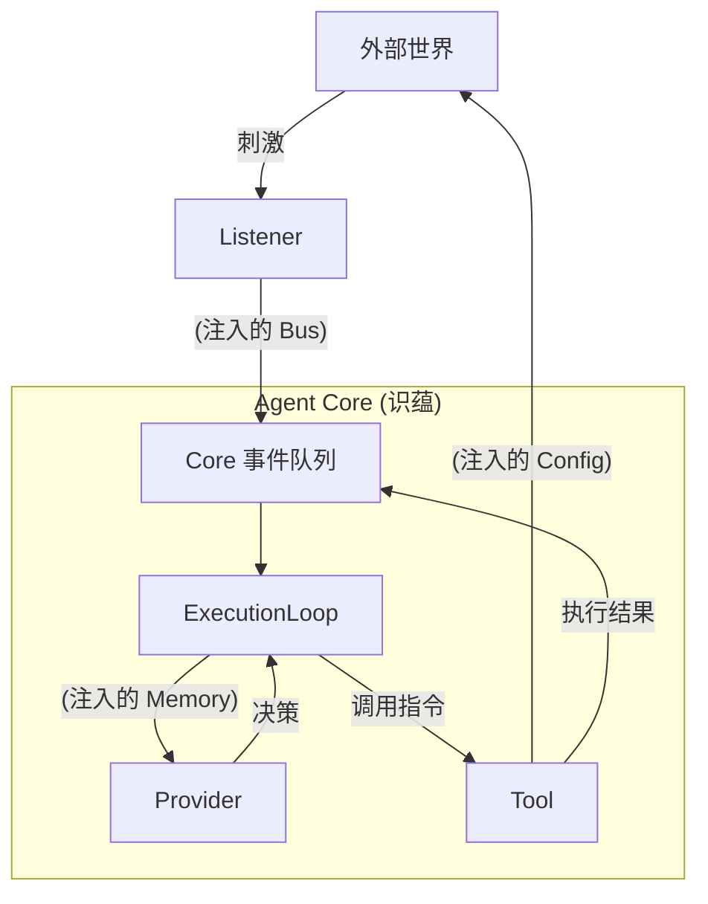

# 20. 依赖编织与控制回路 (Dependency Wiring & Control Loop)

本文档深入探讨 **协调层 (Coordination Layer)** 如何通过精密的 **依赖注入 (Dependency Injection)** 机制，将孤立的五蕴插件编织成一个连续的、有生命力的控制回路。

## 1. 核心概念：从零件到有机体

一个 Agent 就像一个精密仪器。
*   **插件 (Plugins)** 是散落的零件（齿轮、马达、传感器）。
*   **Core (识蕴)** 是机壳与主轴。
*   **依赖注入** 则是将这些零件安装到正确位置并锁紧螺丝的过程。

如果没有正确的注入，Listener 听到了声音却无法传递给大脑，Provider 想出了对策却无法驱动手脚。

---

## 2. 协调层的编织任务 (The Wiring Tasks)

当 Agent 启动时，协调层（或由其委派的 Loader）执行以下「编织」动作：

### A. 感知回路的接合 (Wiring the Senses)
*   **对象：** `Listener` (受)
*   **注入物：** `EventBus` (事件总线)
*   **目的：** 确保外界刺激能转化为 Core 内部的 `Input Event`。
*   **逻辑：**
    ```typescript
    // Loader 伪代码
    listener.initialize({
      // 注入一个回调函数，让 Listener 可以触发 Core 的神经冲动
      emitInput: (data) => core.eventQueue.push(data)
    });
    ```

### B. 认知回路的接合 (Wiring the Mind)
*   **对象：** `Provider` (想)
*   **注入物：** `Memory` (记忆体) & `Context`
*   **目的：** 确保思考具有连续性与上下文。
*   **逻辑：** Provider 本身不持有状态，它依赖 Core 注入的 `context.memory` 来回溯过往对话。

### C. 行动回路的接合 (Wiring the Limbs)
*   **对象：** `Tool` (行)
*   **注入物：** `Config` (配置与权限) & `Logger`
*   **目的：** 确保行动是获得授权的，且结果可被追踪。
*   **逻辑：**
    ```typescript
    tool.initialize({
      config: { apiKey: "...", rootDir: "/safe/path" }, // 安全边界注入
      logger: core.logger.child({ scope: "Tool:FS" })   // 监控注入
    });
    ```

### D. 跨插件服务的接合 (Wiring Cross-Plugin Services)
*   **对象：** 依赖于其他插件的 Composite Plugin (如 Workflow)。
*   **注入物：** `dependencies` 对象。
*   **逻辑：**
    *   协调层先初始化 `SkillPlugin`，获取其 `MarkdownParser` 实例。
    *   在初始化 `WorkflowPlugin` 时，将该实例注入 `context.dependencies['standard-function-skill']`。
    *   这确保了功能模块之间的**水平协作**。

---

## 3. 形成的控制回路 (The Resulting Loop)

经过上述编织，一个标准的 OODA (Observe-Orient-Decide-Act) 回路就形成了：



## 4. 断链与诊断 (Troubleshooting Broken Loops)

协调层还负责监控回路的完整性。如果在启动检查时发现：
*   **有 Listener 没 Provider:** 这是「植物人」状态（能听不能想），发出警告。
*   **有 Provider 没 Listener:** 这是「缸中之脑」状态（能想但没输入），除非是纯任务型 Agent，否则视为配置错误。
*   **Tool 需要 Config 但注入为空:** 这是「瘫痪」状态，启动失败。

## 5. 总结

依赖注入不只是一种程序写法，它是 **Agent 的神经外科手术**。协调层通过精准的注入，确保了五蕴皆空（组件解耦）的同时，又能五蕴炽盛（功能协同），让 Agent 成为一个活着的有机体。
