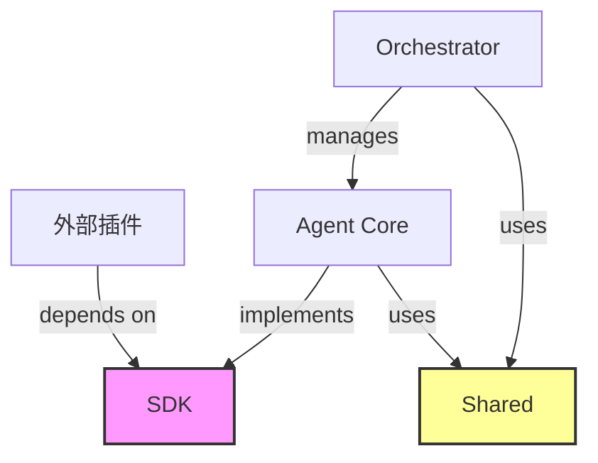

# 03. SDK 与共享库结构规范 (Shared Libraries & SDK Structure)

本文档定义了 `packages/sdk` 与 `packages/shared` 的内部结构与职责。这两个库是 OpenStarry 生态系的基石，确保了核心 (Core) 与插件 (Plugins) 之间的解耦。

## 1. `packages/sdk` (The Public Contract)

**定位：** 这是 OpenStarry 对外暴露的「法律契约」。
**原则：**
*   **零依赖 (Zero Dependencies):** SDK 不应依赖任何运行时逻辑，只包含 Type 定义、抽象类 (Abstract Classes) 和 轻量级 DTO。
*   **插件开发者必备:** 任何第三方插件开发者只需安装 `@openstarry/sdk` 即可开发，无需安装 Core。

### 目录结构

```text
sdk/
├── src/
│   ├── types/              # 纯 TypeScript 类型定义
│   │   ├── agent.ts        # IAgent, IAgentConfig
│   │   ├── message.ts      # IMessage, Role
│   │   ├── tool.ts         # ITool, ToolCallRequest
│   │   └── plugin.ts       # IPlugin, IPluginContext
│   ├── interfaces/         # 核心组件的行为接口
│   │   ├── llm.ts          # ILanguageModelProvider
│   │   └── storage.ts      # IVectorStore, IKeyValueStore
│   ├── errors/             # 标准错误定义 (确保错误类型统一)
│   │   └── base.ts         # AgentError, ToolExecutionError
│   └── index.ts            # 统一导出
└── package.json
```

### 关键类型定义示例

我们使用 TypeScript Interface 来定义「契约」：

```typescript
// 插件必须实现的接口
export interface IPlugin {
  id: string;
  name: string;
  version: string;
  initialize(context: IPluginContext): Promise<void>;
  shutdown(): Promise<void>;
}

// 核心传递给插件的上下文 (受限权限)
export interface IPluginContext {
  logger: ILogger;
  config: Record<string, any>;
  registerTool(tool: ITool): void;
  registerListener(listener: IListener): void;
}
```

---

## 2. `packages/shared` (Common Utilities)

**定位：** 这是系统内部的「工具箱」，供 `packages/core` 和 `apps/daemon` 共用。
**原则：**
*   **无状态 (Stateless):** 这里的函数应该是纯函数 (Pure Functions)。
*   **跨平台:** 代码应能在 Node.js 和 Browser 环境中运行 (尽量避免依赖 `fs`, `net` 等特定模块，或将其封装)。

### 目录结构

```text
shared/
├── src/
│   ├── logger/             # 结构化日志封装 (Pino/Winston Wrapper)
│   ├── utils/              # 通用工具函数
│   │   ├── uuid.ts         # ID 生成器
│   │   ├── sleep.ts        # 异步等待
│   │   └── validation.ts   # Zod/Joi schema 验证辅助
│   ├── constants/          # 系统级常量
│   │   └── events.ts       # 核心事件名称定义 (Event Topics)
│   └── index.ts
└── package.json
```

---

## 3. 依赖关系图 (Dependency Graph)

这张图展示了这两个包在架构中的位置：



*   **SDK** 是最底层，最稳定的。
*   **Shared** 是中间层，提供便利性。
*   **Core** 是实作层，依赖上述两者。
    *   **SDK** 是最底层，最稳定的。
*   **Shared** 是中间层，提供便利性。
*   **Core** 是实作层，依赖上述两者。
