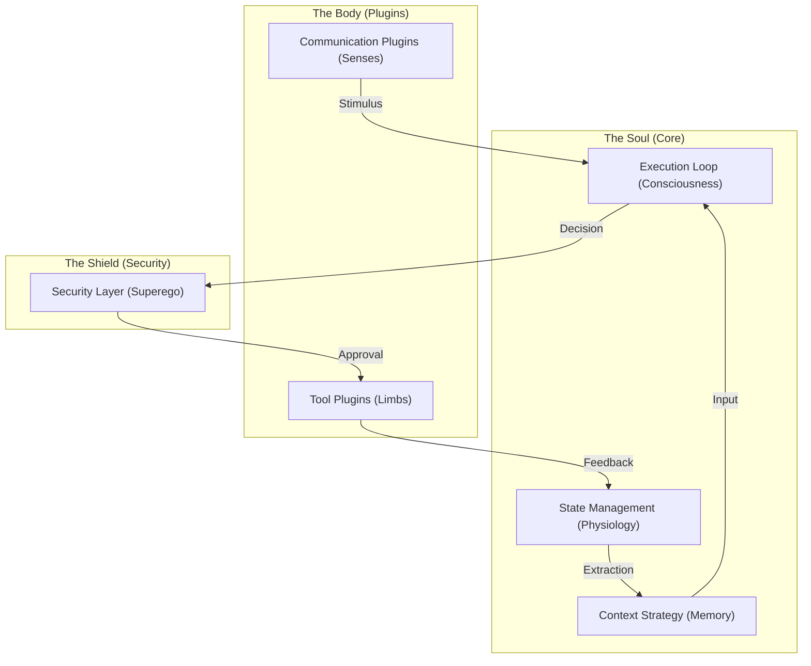

# 00. Core Components Design Philosophy

This document articulates the shared design soul behind the various technical components within the `Agent Core`. Why do we design the execution loop to be event-driven? Why should the security layer function like a circuit breaker? These technical choices serve OpenStarry's ultimate goal: **to create a vital digital entity rather than a rigid program.**

---

## Three Pillars of Philosophy

### 1. Anthropomorphic Cognitive Flow
We simulate the operational mechanism of an Agent as a human cognitive process rather than a traditional Request-Response program.

*   **Execution Loop = Stream of Consciousness**: It not only responds to external requests but also possesses an internal rhythm of thought. Even without user input, an Agent can act because it "thought of something" or a "timer expired."
    *   *(Corresponding Document: `01_Execution_Loop.md`)*
*   **Context = Working Memory**: Memory is dynamic, lossy, and filtered by attention, rather than a perfect database dump.
    *   *(Corresponding Document: `10_Context_Management_Strategy.md`)*
*   **State = Physiological Characteristics**: An Agent possesses immutable, snapshot-able "physiological states," ensuring it exists as a continuous entity.
    *   *(Corresponding Document: `04_State_Manager.md`, `06_State_Persistence_Mechanism.md`)*

### 2. OS-Level Robustness
The Agent Core is designed as a micro-OS kernel, requiring extreme fault tolerance and boundary management.

*   **Headless & Neutral**: The kernel does not rely on any specific UI or protocol; it handles pure logic. All senses (Input) and limbs (Output) are pluggable plugins.
    *   *(Corresponding Document: `02_Communication_Interface.md`)*
*   **Circuit Breakers**: Like a modern power grid, when an Agent attempts dangerous operations (e.g., deleting system files), there must be physical-level blocking mechanisms that do not rely on the LLM's "self-discipline."
    *   *(Corresponding Document: `03_Security_Layer.md`, `07_Safety_Circuit_Breakers.md`, `08_Safety_Implementation.md`)*

### 3. Extreme Modularity
Every part of the system is replaceable. This is not just for scalability but for **Evolution**.

*   **Everything is a Plugin**: Communication, memory strategies, tools, and even the LLM Provider itself are plugins. This means an OpenStarry Agent can continuously replace its organs as technology advances without rewriting its soul.
    *   *(Corresponding Document: `05_Plugin_Infrastructure_Integration.md`, `11_Plugin_Runtime_Isolation.md`)*

---

## Component Collaboration Map

This map illustrates how the various components form a complete closed loop of life. As you read the subsequent Deep Dive documents, please keep this holistic image in mind.
