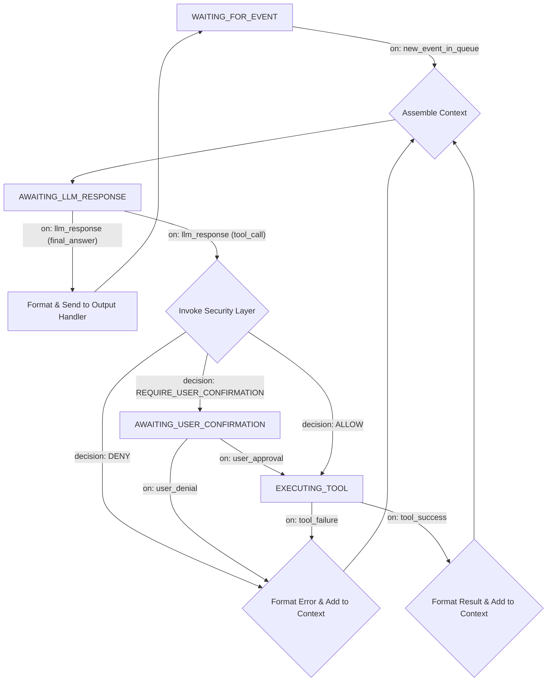

# Deep Dive: LLM-Driven Execution Loop

This document explores the design of the refined "Execution Loop." In the new architecture, the responsibilities of the execution loop have been further simplified, making it more robust and specialized.

## Core Responsibility

The execution loop is an **asynchronous, single-threaded loop** whose **sole responsibility** is to **retrieve an event from the "Internal Event Queue" and complete the processing of that event.** It is indifferent to the source of the event and only concerns itself with the event's content.

---

## State Machine View and Workflow

The entry point of the state machine has become more unified; all external stimuli are first transformed into an event within the queue.

### Key Changes

*   **Unified Starting Point**: The former `WAITING_FOR_USER_INPUT` state has become `WAITING_FOR_EVENT`. The activation of the loop no longer depends on specific input types.
*   **Event-Driven**: The entire workflow is triggered by `on: new_event_in_queue`. The event's `payload` contains specific content, such as `{ "source": "ui", "type": "user_input", "data": "Hello" }` or `{ "source": "mcp_bus", "type": "mcp_message", "data": { "action": "..." } }`.
*   **Output Handling**: The original `Send to UI` has become a more general `Send to Output Handler`. The Core will send the final response back to the correct channel based on the original event's `source` (e.g., via a UI plugin interface or an MCP `Tool`).

---

## Key Implementation Details

### 1. Context Assembly
The core of this step remains unchanged, but the source of the "latest input" is now the event's `payload`.
*   **System Prompt**
*   **Conversation History**
*   **Tool Definitions**
*   **Latest Event Payload**: The loop formats the event's `payload` into text (e.g., "Received a message of type [type] from [source], content: ...") as the latest input for the LLM to process.

### 2. Error Handling
The error handling mechanism remains unchanged and continues to be critical for the robustness of the loop. Failures in LLM calls or tool execution should be caught and fed back to the LLM as information, enabling self-correction.
