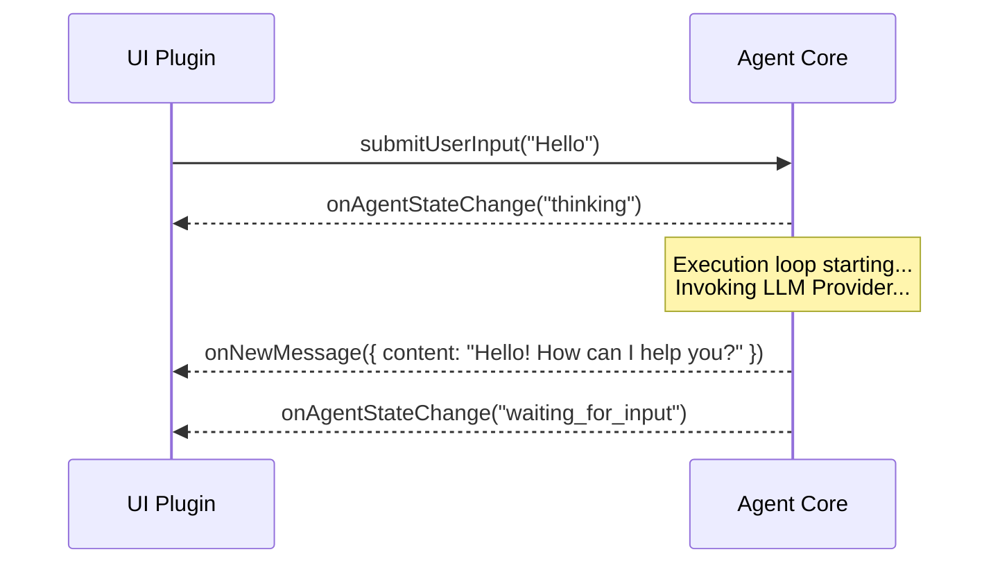
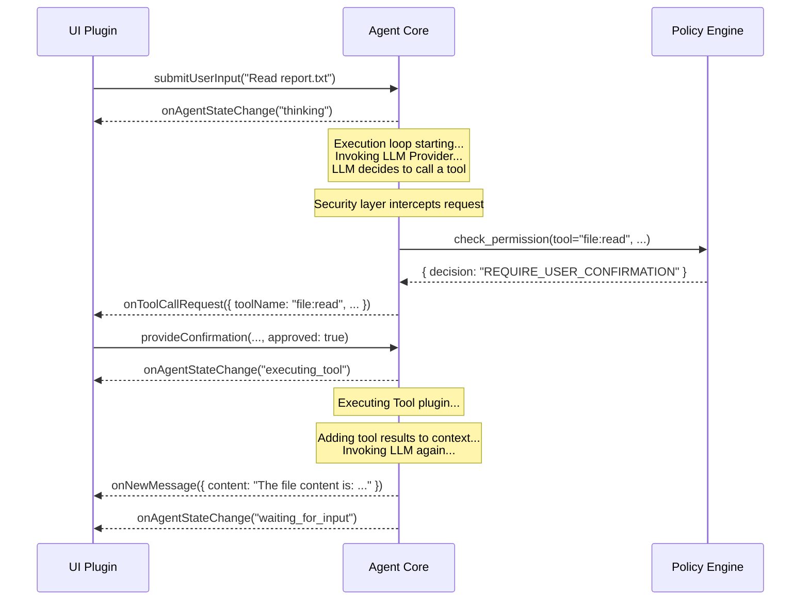

# Deep Dive: Bi-directional Communication Interface

This document explores the "nervous system" between the Core and UI plugins—the bi-directional communication interface, including the protocol, events, and specific command definitions.

## Design Principles

The interface follows the "event-driven" and "command pattern" designs to achieve maximum decoupling between the Core and UI. The Core broadcasts events, and the UI responds to those events to update the view; the UI sends commands, and the Core responds to those commands to change its state.

---

## Interaction Flow (Sequence Diagram)

### Scenario 1: Simple Q&A


### Scenario 2: Tool Call


---

## Detailed Interface Definition

### Events: Core -> UI

*   **`onNewMessage(payload: object)`**
    *   **Data Structure (Payload):**
        ```json
        {
          "content": "string",
          "format": "markdown" | "text",
          "metadata": {
            "source_documents": [ /* RAG results */ ],
            "latency_ms": 1200
          }
        }
        ```

*   **`onToolCallRequest(payload: object)`**
    *   **Data Structure (Payload):**
        ```json
        {
          "confirmationId": "uuid-1234",
          "toolName": "shell:execute",
          "args": { "command": "ls -l" },
          "security_warning": {
            "level": "CRITICAL" | "WARN" | "INFO",
            "message": "The agent is attempting to execute a Shell command..."
          }
        }
        ```

### Commands: UI -> Core

*   **`submitUserInput(payload: object)`**
    *   **Data Structure (Payload):**
        ```json
        {
          "text": "string",
          "attachments": [ // For supporting multimodal input
            { "type": "image", "data": "base64-encoded-string" }
          ]
        }
        ```
*   **`provideConfirmation(payload: object)`**
    *   **Data Structure (Payload):**
        ```json
        {
          "confirmationId": "uuid-1234",
          "approved": true | false
        }
        ```
---

## Implementation Protocols Discussion

*   **Monolithic:** If the Core and UI run in the same process (e.g., a local desktop TUI application), the simplest implementation uses language-native event mechanisms like Node.js's `EventEmitter`. The Core is an `EventEmitter` instance, and the UI plugin listens to it during initialization.
*   **Client/Server:** If the UI is a remote web application or mobile app, network protocols are required.
    *   **WebSocket:** An ideal choice, providing a persistent bi-directional communication channel where the Core can push events to the UI at any time.
    *   **HTTP Long Polling/SSE:** Alternative options for real-time event pushing.

---

## Session Isolation Architecture

> **Status:** 📋 Planning (Plan05.1)

### Problem Background

The current architecture operates in a "Broadcast" mode. This means if User A connects to the Agent via WebSocket while User B also connects, they will see each other's messages and tool results. While acceptable for single-user scenarios, this represents a major privacy vulnerability in multi-user collaboration or multi-tenant environments.

### Solution

Introduce a Session Isolation mechanism to ensure each client only receives messages belonging to their own session.

```
┌─────────────┐     ┌─────────────┐     ┌─────────────┐
│ Client A    │     │ Client B    │     │ Client C    │
│ sessionId:A │     │ sessionId:B │     │ sessionId:C │
└──────┬──────┘     └──────┬──────┘     └──────┬──────┘
       │                   │                   │
       └───────────────────┼───────────────────┘
                           │
                    ┌──────▼──────┐
                    │   Listener  │
                    │ Tag sessionId │
                    └──────┬──────┘
                           │
                    ┌──────▼──────┐
                    │    Core     │
                    │ Passthrough │
                    │  sessionId  │
                    └──────┬──────┘
                           │
                    ┌──────▼──────┐
                    │     UI      │
                    │ Filter push │
                    │ by sessionId│
                    └─────────────┘
```

### Implementation Logic

1. **Listener Layer:** Tag inputs with a `sessionId` (e.g., `ws-client-1`) upon reception.
   ```typescript
   ctx.pushInput({
     source: "websocket",
     inputType: "user_input",
     data: msg.payload?.text ?? "",
     sessionId: clientId,  // New
     replyTo: clientId,
   });
   ```

2. **Core Layer:** Pass the `sessionId` through to output events during processing.
   ```typescript
   interface AgentEvent {
     type: AgentEventType;
     timestamp: number;
     payload: {
       sessionId?: string;  // New
       // ...other fields
     };
   }
   ```

3. **UI Layer:** Filter events in `onEvent`.
   ```typescript
   onEvent(event: AgentEvent): void {
     const sessionId = event.payload?.sessionId;

     if (sessionId && connections.has(sessionId)) {
       // Targeted push to specific client
       const conn = connections.get(sessionId)!;
       conn.ws.send(JSON.stringify(event));
     } else if (!sessionId) {
       // System broadcast (no sessionId) pushed to everyone
       for (const conn of connections.values()) {
         conn.ws.send(JSON.stringify(event));
       }
     }
   }
   ```

### Acceptance Criteria

- ☐ WebSocket User A cannot see User B's conversation.
- ☐ System broadcasts (without `sessionId`) are received by all users.
- ☐ No cross-session message leakage.

### Relationship with MCP Protocol

**This is a prerequisite for entering Plan06 (MCP Integration).**

In MCP protocol scenarios, multiple external clients will connect to the Agent simultaneously. Without session isolation:
- Client A will see Client B's tool results.
- Data privacy will be compromised.
- Multi-tenant security principles will be violated.
