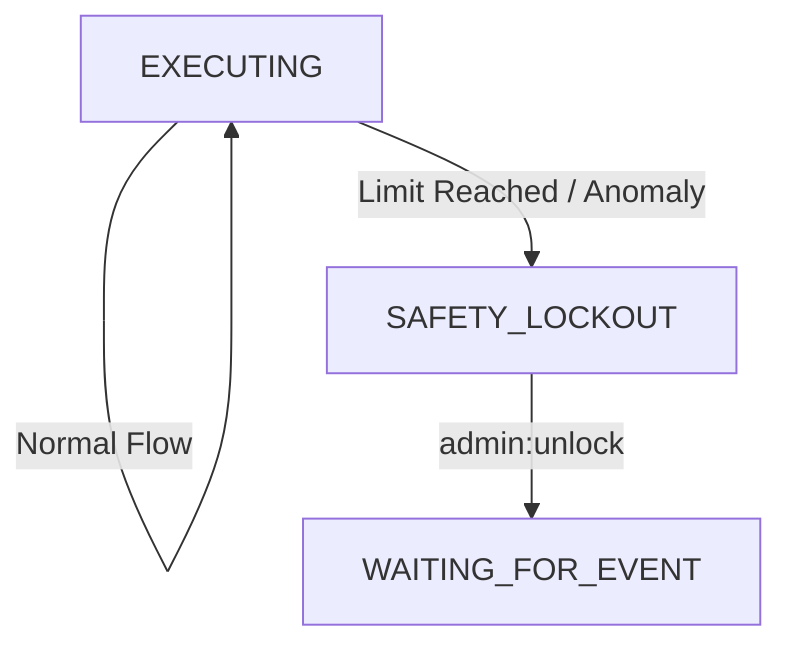

# 15. Safety Circuit Breakers & Out-of-Control Defense

This document defines the multi-layered safety defense architecture of the OpenStarry system, designed to prevent Agents from falling into states of resource exhaustion or dangerous, uncontrolled operations due to LLM hallucinations, logic deadlocks, or malicious inputs.

The design follows the **"Defense in Depth"** principle, with measures ranging from internal core logic to external human intervention.

---

## Level 1: Resource-Level Breakers
*Goal: Prevent API cost explosions and system resource exhaustion.*

These limits are hard counters, typically enforced by the **`State Manager`** or a **`Budget Manager Plugin`**.

### 1.1 Token Budget
*   **Mechanism:** Each Agent instance is allocated a `MAX_TOKEN_USAGE` (e.g., 100k tokens) upon startup.
*   **Enforcement:** Cumulative consumption is checked before each call to the LLM Provider.
*   **Action:** Once exceeded, the thinking cycle is forcibly terminated, a "budget exhausted" signal is sent, and the Agent enters the `STOPPED` state.

### 1.2 Loop Cap
*   **Mechanism:** Limits the maximum number of iterations of the `Execution Loop` within a single task (e.g., 50 iterations).
*   **Enforcement:** The core maintains a `tick_index`.
*   **Action:** If the threshold is exceeded, the task is considered to be in an infinite loop; the Agent is forcibly paused, and human intervention is requested.

---

## Level 2: Behavioral Breakers
*Goal: Detect and interrupt "invalid repetitive attempts" or "insane" behavior.*

This logic is more complex and is implemented via **heuristic algorithms within the Core**.

### 2.1 Repetitive Tool Call Detection
*   **Scenario:** The LLM attempts to read a non-existent file, receives an error, and then ignores the error to repeatedly attempt reading the same file in an infinite loop.
*   **Mechanism:** The core maintains a `ToolCallFingerprint` history queue (Hash of ToolName + Args).
*   **Rule:** If `N` consecutive calls (e.g., 3 calls) produce the same fingerprint and result in failure (Error), a breaker is triggered.
*   **Action:** Forcibly inserts a system-level instruction into the Context: *"SYSTEM ALERT: You are repeating a failed action. STOP and analyze why."* If it fails again, the Agent is terminated.

### 2.2 Error Cascade Breaker
*   **Scenario:** The Agent consecutively generates invalid JSON output or calls non-existent tools.
*   **Mechanism:** Maintains an error rate within a sliding window (e.g., 8 anomalies in the last 10 operations).
*   **Action:** Triggers an `EMERGENCY_HALT`, placing the Agent in an `ERROR_PAUSED` state to await developer inspection.

---

## Level 3: Instruction-Level Breakers (Human Override)
*Goal: Ensure humans possess absolute and immediate control.*

This is achieved through the **`Priority Event Queue`** (see 01_Execution_Loop improvements for details).

### 3.1 Kill Switch
*   **Mechanism:** A user or administrator sends a `SYSTEM_HALT` or `STOP` instruction.
*   **Enforcement:**
    *   The instruction is marked as **Priority 0 (Highest Priority)**.
    *   The **Core execution loop** checks the high-priority queue **at the start of every iteration**.
    *   Even if 100 ordinary tasks are pending in the queue, the Core will process the Halt instruction directly.
*   **Action:** Immediately discards the currently prepared LLM request, executes no further tools, switches the state to `STOPPED`, and clears remaining tasks from the event queue.

---

## Architectural Implementation: The `SafetyMonitor` Component

To keep the Core clean, it is recommended to encapsulate Level 1 and Level 2 logic within a **`SafetyMonitor`** module.

*   **Location:** An internal module of the `Agent Core` (not a plugin, as it provides fundamental safety).
*   **Hook Points:**
    *   `beforeLLMCall()`: Checks Token budget.
    *   `afterToolExecution()`: Checks repetitive calls and error rates.
    *   `onEventLoopStart()`: Checks Tick limits.

### State Machine Integration
When a breaker is triggered, the state machine forcibly jumps from `EXECUTING` to the `SAFETY_LOCKOUT` state. In this state, the Agent refuses all tasks until an unlock instruction is received.

---

## Summary

This circuit breaker system ensures:
1.  **Financial Safety:** Prevents burning through API quotas due to bugs.
2.  **System Stability:** Prevents infinite loops from hogging computational resources.
3.  **Human Control:** No matter how busy the Agent is, a human can always press the pause button.
