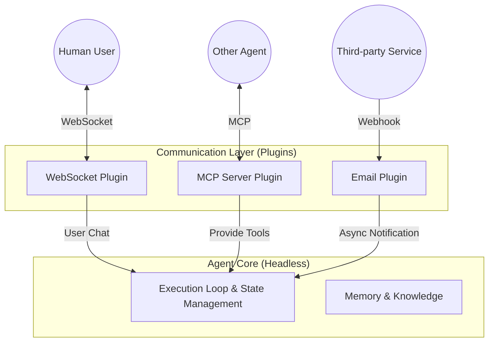

# 08. Communication Protocol Strategy: An Open Multi-headed Architecture

This document defines the core architectural philosophy concerning "Communication" within the OpenStarry system. We do not mandate any single transport protocol; instead, communication capabilities are entirely decentralized to the plugin layer.

## Core Philosophy: Communication as a Plugin

In OpenStarry, the **Agent Core is "Protocol Agnostic."** The Core only understands internal "Events" and "Intents" and remains oblivious to the specific methods the external world uses to communicate with it.

All external communications—whether chatting with humans or collaborating with other machines—must be adapted through **Communication Plugins**.

This design allows an Agent to be a "Multi-headed" entity: it can interact with different objects across various channels and protocols simultaneously.

---

## Taxonomy of Communication Plugins

To better manage diverse communication needs, we categorize communication plugins into two major types:

### 1. Channel Plugins - For Humans and Business
These plugins primarily handle **unstructured or semi-structured** interactions, typically simulating "Conversations."

*   **Target Audience:** Human users, chatbot platforms, notification systems.
*   **Interaction Mode:** 
    *   **Inbound:** Transforms external messages (Text/Image) into `core.submitUserInput()`.
    *   **Outbound:** Listens for `onNewMessage` events and renders them as text or cards for transmission.
*   **Typical Examples:**
    *   **WebSocket / HTTP Server:** For Web UIs or mobile apps.
    *   **WhatsApp / Telegram / Discord Adapters:** For instant messaging software.
    *   **Email Listener:** For asynchronous communication via email.
    *   **Voice Interface:** Speech-to-Text (STT) and Text-to-Speech (TTS) interfaces.

### 2. Protocol Plugins - For Machines and Capabilities
These plugins handle **highly structured** data exchange, typically simulating "Remote Procedure Calls (RPC)" or "Resource Access."

*   **Target Audience:** Other Agents, legacy systems, microservices, IDEs, databases.
*   **Interaction Mode:** 
    *   **As Server (Invoked):** Maps external requests to `core.executeTool()` (direct execution of capabilities) or triggers specific system commands.
    *   **As Client (Active Call):** Transforms the Agent's `Tool Call` intent into specific network requests (HTTP Request, MCP Packet, gRPC Call).
*   **Typical Examples:**
    *   **MCP (Model Context Protocol):** **(Recommended Standard)** For standardized tool interoperability and resource sharing.
    *   **REST API Adapter:** Exposes the Agent as a set of RESTful endpoints.
    *   **ActivityPub:** Allows the Agent to become a node in the Fediverse.
    *   **Custom Binary Protocol:** Proprietary protocols for high-frequency trading or low-latency scenarios.

---

## The Multi-headed Agent Model

A powerful OpenStarry Agent typically loads multiple communication plugins simultaneously, forming a "multi-headed" configuration:

### Scenario Example: The All-around Assistant

An "All-around Business Assistant Agent" could be configured as follows:
1.  **WebSocket Plugin:** Connects to the user's mobile app, allowing the user to issue voice commands at any time.
2.  **MCP Client Plugin:** Connects to the company's "Database Retrieval MCP Server" to fetch sales data.
3.  **Slack Adapter Plugin:** Joins the company's Slack workspace, monitors for `@mention` of the assistant, and responds automatically.

In this scenario, the Core does not need to know that it is simultaneously handling WebSocket, MCP, and Slack protocols. It simply receives `Input` continuously, thinks, and generates `Output`. It is the responsibility of each plugin to distribute these outputs back to the correct channels.

---

## The Special Status of MCP

While we support multiple protocols, we view **MCP (Model Context Protocol)** as a **First-class Citizen** in the ecosystem.

*   **Why?** Because MCP is specifically designed for the AI era, addressing "Prompt length limits" and "dynamic context loading"—problems that traditional REST or WebSocket cannot solve elegantly.
*   **Strategy:** We recommend using MCP as the default standard between Agents (Agent-to-Agent) and between Agents and tools (Agent-to-Tool), although it is never mandated. For details, see `../Plugin_Infrastructure_Examples/02_MCP_Protocol_Integration.md`.