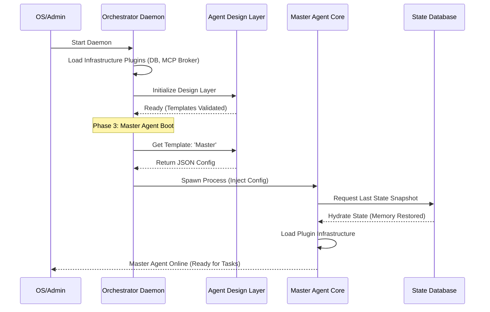

# 13. System Boot Sequence and Initial Logic

This document defines the loading sequence and dependencies of the "Daemon Layer," "Design Layer," and "Agent Core" in OpenStarry during cold boot and runtime.

## Core Dependency Chain

System startup must follow this logical chain:
**Physical Environment Ready -> Orchestrator Daemon Startup -> Retrieve Agent Blueprint (Template) -> Spawn Agent Entity -> Restore Historical State.**

---

## Boot Stages in Detail

### Phase 1: Daemon Layer Boot
This is the startup phase of the system's "god process."

1.  **Orchestrator Daemon Startup**: The Daemon process is started by the operating system (e.g., systemd or a service script).
2.  **Load Infrastructure Plugins**: The Daemon loads and starts "Infrastructure Plugins" based on configuration. This may include starting a local MCP Message Broker or initializing the State DB Service. The Daemon itself does not hardcode specific middleware logic.
3.  **Health Check**: The Daemon scans previous execution logs to check for abnormal interruptions that require recovery.

### Phase 2: Design Layer Ready
Before creating any agents, their "gene pool" must be prepared.

1.  **Agent Design Layer Service Online**: Start the Design Layer API service (or initialize the local template directory).
2.  **Template Validation**: Scan all Agent Templates to validate JSON format and the legality of tool definitions.
3.  **Provide Query Interface**: Prepare to respond to configuration query requests from the Daemon (e.g., `GET /templates/master-agent`).

### Phase 3: Master Agent Bootstrapping
This is the process of generating the system's first intelligent entity.

1.  **Retrieve Blueprint**: The Daemon requests the detailed configuration of the "Master Agent" from the Design Layer.
2.  **Spawn Process**: The Daemon creates a new OS process to run the **Agent Core** based on the configuration.
3.  **Core Self-Initialization**:
    *   **Load Infrastructure**: The Agent Core initializes its internal plugin loader.
    *   **Restore Memory**: The Core reads the last `State Snapshot` (if it exists) from the State DB via the interface provided by the Daemon.
    *   **Load Listeners**: Starts UI or Webhook plugins to officially begin communication with the outside world.

### Phase 4: Worker Agents on Demand
As the system runs, it expands dynamically based on task requirements.

1.  **Decision Delegation**: The Master Agent determines that a task requires collaboration and invokes the `AgentManagerTool`.
2.  **Request Spawning**: `AgentManagerTool` sends a creation request to the Daemon.
3.  **Retrieve Worker Blueprint**: The Daemon requests the corresponding Worker template from the Design Layer.
4.  **Process Spawning**: The Daemon creates the Worker Agent process and repeats the initialization flow from Phase 3 (though usually more lightweight).

5.  **Execute Core Loop**: Invokes `Core.start()`.

---

## 3. Kernel Bootstrapping Mechanism: Host Bootstrapping Pattern

To resolve the paradox where a "Pure Kernel" cannot read its own configuration, we adopt the Host Bootstrapping Pattern.

### Division of Labor

*   **Host (Coordinating Layer):** 
    *   **Environment:** A Node.js process with native OS privileges.
    *   **Tasks:** Reads `agent.json`, scans disk directories, and physically loads (`require/import`) plugin code.
*   **Core (Kernel):** 
    *   **Environment:** An absolutely pure logical container.
    *   **Tasks:** Receives plugin modules fed by the Host, performs initialization, and starts thinking.

### The Micro Sequence

1.  **Host Awakening:** Executes `openstarry start`, and the Host process starts.
2.  **Host Preparation:** The Host "grabs" the required plugins from the disk into memory based on the configuration file.
3.  **Soul Injection:** The Host creates an `AgentCore` instance and passes in the "captured capabilities."
4.  **Core Operation:** The Core discovers it has been granted capabilities and begins executing tasks.

**This ensures the cross-platform nature of the kernel—as long as the host can provide the corresponding capability plugins, the kernel can run in any environment.**

---

## Key Rules

*   **Uniqueness**: At any given time, an Agent with the same ID can only have one active process managed by the Daemon.
*   **Configuration Immutability**: Once an Agent is started, its core configuration (blueprint) cannot be changed during that lifecycle. To update the configuration, the process must be restarted.
*   **Degraded Boot**: If the Design Layer service is unavailable, the Daemon should attempt to load locally cached templates to maintain basic operation.
