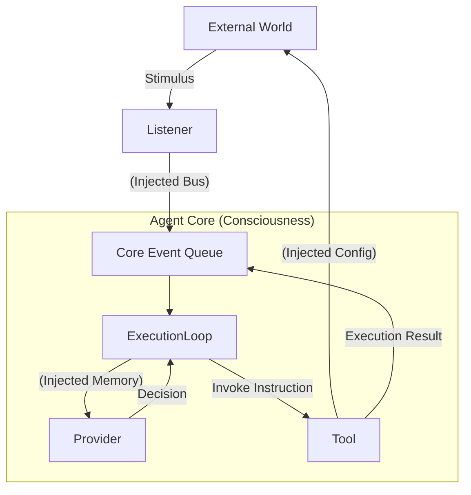

# 20. Dependency Wiring & Control Loop

This document explores how the **Coordination Layer** weaves isolated "Five Aggregates" plugins into a continuous, vital control loop through a precise **Dependency Injection** mechanism.

## 1. Core Concept: From Parts to Organism

An Agent is like a precision instrument.
*   **Plugins** are scattered parts (gears, motors, sensors).
*   **Core (Consciousness)** is the casing and the main shaft.
*   **Dependency Injection** is the process of installing these parts in their correct positions and tightening the screws.

Without correct injection, a Listener might perceive sound but cannot transmit it to the brain, or a Provider might devise a strategy but cannot drive the limbs.

---

## 2. The Wiring Tasks of the Coordination Layer

When an Agent starts, the Coordination Layer (or its delegated Loader) performs the following "wiring" actions:

### A. Wiring the Senses
*   **Object:** `Listener` (Sensation)
*   **Injected Material:** `EventBus`
*   **Purpose:** To ensure that external stimuli are transformed into internal `Input Events` for the Core.
*   **Logic:**
    ```typescript
    // Loader Pseudo-code
    listener.initialize({
      // Inject a callback function to let the Listener trigger nerve impulses in the Core
      emitInput: (data) => core.eventQueue.push(data)
    });
    ```

### B. Wiring the Mind
*   **Object:** `Provider` (Perception)
*   **Injected Material:** `Memory` & `Context`
*   **Purpose:** To ensure that thinking possesses continuity and context.
*   **Logic:** Providers themselves do not hold state; they rely on the `context.memory` injected by the Core to trace back past conversations.

### C. Wiring the Limbs
*   **Object:** `Tool` (Volition)
*   **Injected Material:** `Config` (Configuration & Permissions) & `Logger`
*   **Purpose:** To ensure that actions are authorized and results are traceable.
*   **Logic:**
    ```typescript
    tool.initialize({
      config: { apiKey: "...", rootDir: "/safe/path" }, // Safety boundary injection
      logger: core.logger.child({ scope: "Tool:FS" })   // Monitoring injection
    });
    ```

### D. Wiring Cross-Plugin Services
*   **Object:** Composite Plugins dependent on other plugins (e.g., Workflow).
*   **Injected Material:** `dependencies` object.
*   **Logic:**
    *   The Coordination Layer first initializes the `SkillPlugin` to obtain its `MarkdownParser` instance.
    *   During the initialization of the `WorkflowPlugin`, this instance is injected into `context.dependencies['standard-function-skill']`.
    *   This ensures **horizontal collaboration** between functional modules.

---

## 3. The Resulting Control Loop

Through the aforementioned wiring, a standard OODA (Observe-Orient-Decide-Act) loop is formed:



## 4. Troubleshooting Broken Loops

The Coordination Layer is also responsible for monitoring the integrity of the loop. If the startup check discovers:
*   **Listener but no Provider:** This is a "persistent vegetative state" (can hear but cannot think); a warning is issued.
*   **Provider but no Listener:** This is a "brain in a vat" state (can think but has no input); unless it's a pure task-oriented Agent, it's considered a configuration error.
*   **Tool requires Config but injection is empty:** This is a "paralysis" state; startup fails.

## 5. Summary

Dependency injection is more than just a coding practice; it is **neurosurgery for an Agent**. Through precise injection, the Coordination Layer ensures that while components are decoupled (Emptiness of the Five Aggregates), they function together harmoniously (Blazing of the Five Aggregates), making the Agent a living organism.破。
