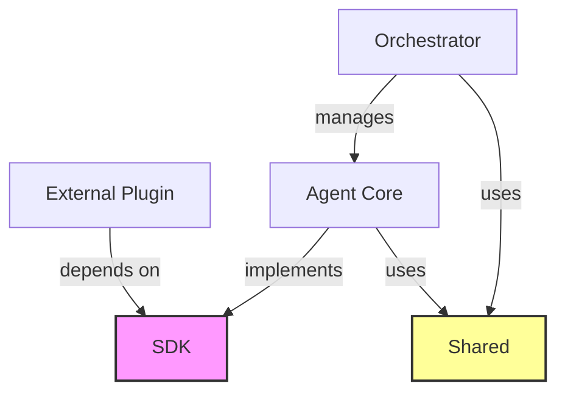

# 03. Shared Libraries & SDK Structure Specification

This document defines the internal structure and responsibilities of `packages/sdk` and `packages/shared`. These two libraries are the cornerstones of the OpenStarry ecosystem, ensuring decoupling between the Core and Plugins.

## 1. `packages/sdk` (The Public Contract)

**Positioning:** This is the "legal contract" exposed by OpenStarry to the outside world.
**Principles:**
*   **Zero Dependencies:** The SDK should not depend on any runtime logic; it contains only type definitions, abstract classes, and lightweight DTOs.
*   **Essential for Plugin Developers:** Any third-party plugin developer only needs to install `@openstarry/sdk` to develop, without needing to install the Core.

### Directory Structure

```text
sdk/
├── src/
│   ├── types/              # Pure TypeScript type definitions
│   │   ├── agent.ts        # IAgent, IAgentConfig
│   │   ├── message.ts      # IMessage, Role
│   │   ├── tool.ts         # ITool, ToolCallRequest
│   │   └── plugin.ts       # IPlugin, IPluginContext
│   ├── interfaces/         # Behavioral interfaces for core components
│   │   ├── llm.ts          # ILanguageModelProvider
│   │   └── storage.ts      # IVectorStore, IKeyValueStore
│   ├── errors/             # Standard error definitions (ensuring uniform error types)
│   │   └── base.ts         # AgentError, ToolExecutionError
│   └── index.ts            # Unified exports
└── package.json
```

### Key Type Definition Examples

We use TypeScript interfaces to define the "contract":

```typescript
// Interface that plugins must implement
export interface IPlugin {
  id: string;
  name: string;
  version: string;
  initialize(context: IPluginContext): Promise<void>;
  shutdown(): Promise<void>;
}

// Context passed to plugins by the core (with restricted permissions)
export interface IPluginContext {
  logger: ILogger;
  config: Record<string, any>;
  registerTool(tool: ITool): void;
  registerListener(listener: IListener): void;
}
```

---

## 2. `packages/shared` (Common Utilities)

**Positioning:** This is the internal "toolbox" shared by `packages/core` and `apps/daemon`.
**Principles:**
*   **Stateless:** Functions here should be pure functions.
*   **Cross-platform:** Code should be capable of running in both Node.js and browser environments (avoiding direct dependencies on modules like `fs` or `net`, or encapsulating them).

### Directory Structure

```text
shared/
├── src/
│   ├── logger/             # Structured logging encapsulation (Pino/Winston wrapper)
│   ├── utils/              # Common utility functions
│   │   ├── uuid.ts         # ID generator
│   │   ├── sleep.ts        # Asynchronous sleep
│   │   └── validation.ts   # Zod/Joi schema validation helpers
│   ├── constants/          # System-level constants
│   │   └── events.ts       # Core event name definitions (Event Topics)
│   └── index.ts
└── package.json
```

---

## 3. Dependency Graph

This diagram illustrates the positions of these two packages within the architecture:



*   **SDK** is at the bottom layer and is the most stable.
*   **Shared** is the middle layer, providing convenience.
*   **Core** is the implementation layer, depending on both of the above.
