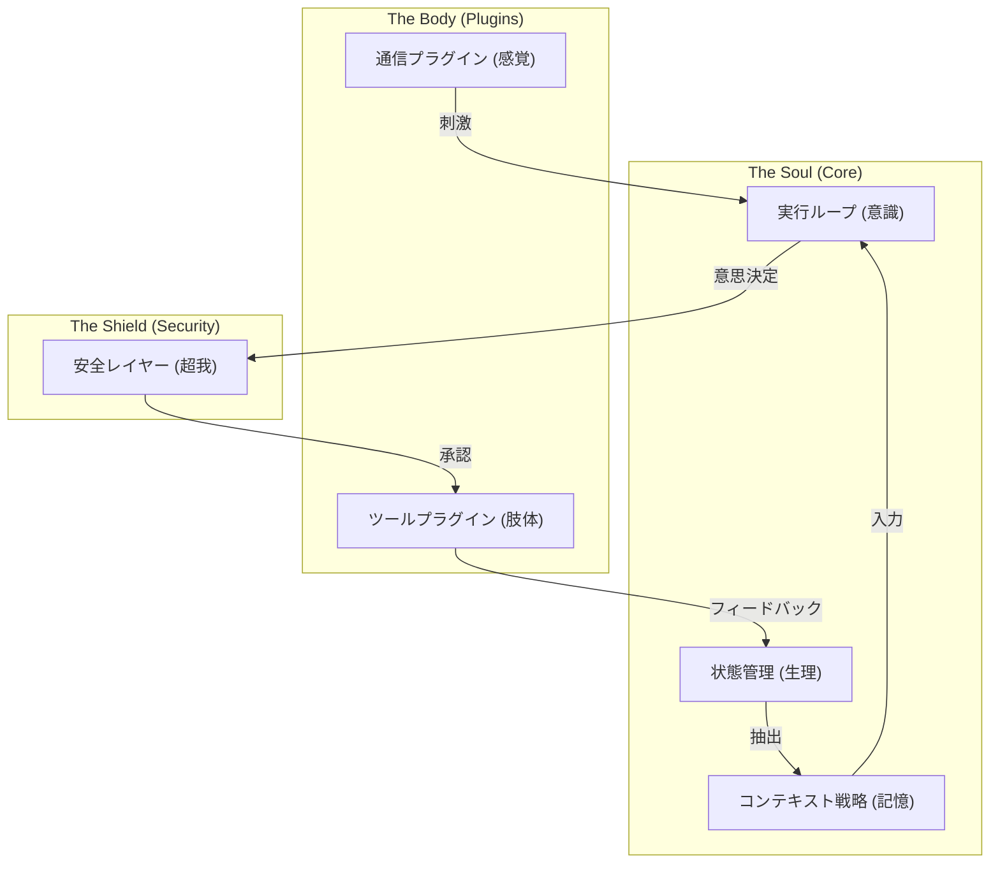

# 00. コアコンポーネント設計哲学 (Core Philosophy)

このドキュメントでは、 `Agent Core` 内部の各技術コンポーネントの背後にある共通の設計思想（ソウル）について説明します。なぜ実行ループをイベント駆動型に設計するのか？なぜセキュリティレイヤーは回路遮断器（サーキットブレーカー）のようでなければならないのか？これらの技術的選択はすべて、 OpenStarry の究極の目標である **「硬直したプログラムではなく、生命力のあるデジタル実体を創造すること」** に奉仕しています。

---

## 3つの柱となる哲学

### 1. 擬人化された認知フロー (Anthropomorphic Cognitive Flow)
私たちはエージェントの動作メカニズムを、従来の Request-Response 型プログラムではなく、人間の認知プロセスとしてシミュレートします。

*   **実行ループ (Loop) = 意識の流れ**：外部のリクエストに応答するだけでなく、内的な思考のリズムも備えています。ユーザーの入力がなくても、エージェントは「何かを思いついた」あるいは「タイマーが切れた」といった理由で行動することができます。
    *   *(対応ドキュメント： `01_Execution_Loop.md` )*
*   **コンテキスト (Context) = 短期記憶**：記憶は動的で、欠落もあり、注意によってフィルタリングされるものであり、完璧なデータベースのダンプではありません。
    *   *(対応ドキュメント： `10_Context_Management_Strategy.md` )*
*   **ステート (State) = 生理的特徴**：エージェントは不変でスナップショット可能な「生理的状態」を持っており、これにより連続して存在する実体であることが保証されます。
    *   *(対応ドキュメント： `04_State_Manager.md`, `06_State_Persistence_Mechanism.md` )*

### 2. OS レベルの堅牢性 (OS-Level Robustness)
Agent Core はマイクロ OS カーネルとして設計されており、極めて高い容錯性と境界管理能力を備えていなければなりません。

*   **ヘッドレスと中立性 (Headless & Neutral)**：カーネルは特定の UI やプロトコルに依存せず、純粋なロジックのみを処理します。すべての感覚（Input）と手足（Output）は、付け替え可能なプラグインです。
    *   *(対応ドキュメント： `02_Communication_Interface.md` )*
*   **安全遮断器 (Circuit Breakers)**：現代の電力網のように、エージェントが危険な操作（システムファイルの削除など）を実行しようとしたとき、 LLM の「自覚」に頼るのではなく、物理的なレベルでの遮断メカニズムがなければなりません。
    *   *(対応ドキュメント： `03_Security_Layer.md`, `07_Safety_Circuit_Breakers.md`, `08_Safety_Implementation.md` )*

### 3. 極限のモジュール化 (Extreme Modularity)
システムのあらゆる部分は交換可能です。これは拡張性のためだけでなく、 **進化 (Evolution)** のためでもあります。

*   **すべてはプラグインである (Everything is a Plugin)**：通信、記憶戦略、ツール、さらには LLM プロバイダー自体もプラグインです。これは、 OpenStarry のエージェントが技術の発展に合わせて魂を書き換えることなく、絶えず器官を交換できることを意味します。
    *   *(対応ドキュメント： `05_Plugin_Infrastructure_Integration.md`, `11_Plugin_Runtime_Isolation.md` )*

---

## コンポーネント協調マップ

このマップは、各コンポーネントがいかにして完全な生命の閉ループを構成しているかを示しています。以降の Deep Dive ドキュメントを読む際は、常にこの全体像を念頭に置いておいてください。
