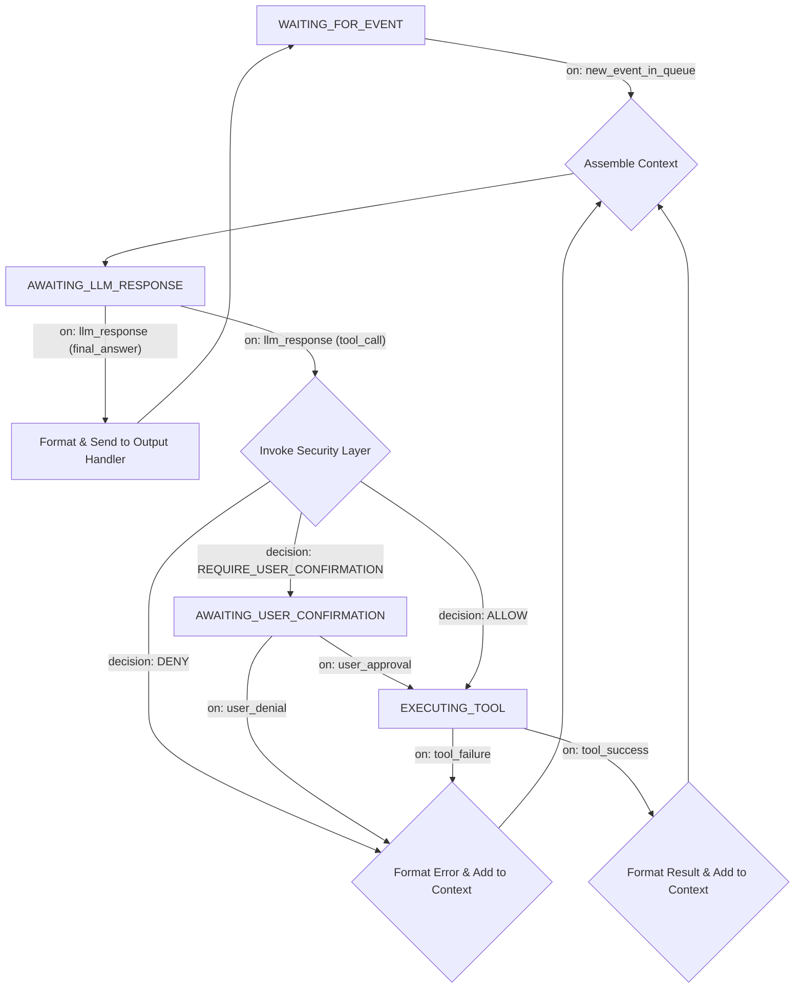

# 深度解析： LLM 駆動の実行ループ (Execution Loop)

このドキュメントでは、洗練された「実行ループ」の設計について深く掘り下げます。新しいアーキテクチャにおいて、実行ループの責務はさらに簡素化され、より堅牢で専一なものとなりました。

## コアの責務

実行ループは **非同期のシングルスレッドループ** であり、その **唯一の責務** は **「内部イベントキュー (Internal Event Queue)」からイベントを取得し、そのイベントの処理を完了させること** です。イベントのソース（どこから来たか）は気にせず、イベントの内容のみを考慮します。

---

## ステートマシンの図とフロー

ステートマシンの入り口がより統一されました。すべての外部からの刺激は、まずキュー内の1つのイベントに変換されます。

### 重要な変更点

*   **統一された起点：** 従来の `WAITING_FOR_USER_INPUT` 状態は `WAITING_FOR_EVENT` になりました。ループの開始は特定の入力タイプに依存しなくなりました。
*   **イベント駆動：** フロー全体が `on: new_event_in_queue` によってトリガーされます。イベントの `payload` には具体的な内容が含まれます。例えば、 `{ "source": "ui", "type": "user_input", "data": "こんにちは" }` や `{ "source": "mcp_bus", "type": "mcp_message", "data": { "action": "..." } }` などです。
*   **出力処理：** 従来の `Send to UI` は、より汎用的な `Send to Output Handler` になりました。コアは元のイベントの `source` に基づいて、最終的な応答を正しいチャネル（例えば UI プラグインのインターフェースや MCP の `Tool` など）に送り返します。

---

## 重要な実装の詳細

### 1. コンテキストのパッケージ化 (Context Assembly)
このステップの核となる部分は変わりませんが、「最新の入力」のソースがイベントの `payload` になります。
*   **システムプロンプト (System Prompt)**
*   **対話履歴 (Conversation History)**
*   **利用可能なツールの定義 (Tool Definitions)**
*   **最新イベントの内容 (Latest Event Payload)：** ループはイベントの `payload` をテキストとしてフォーマットし（例：「 [source] から [type] タイプのメッセージを受信しました。内容は：...」）、 LLM が処理すべき最新の入力として扱います。

### 2. エラー処理
エラー処理メカニズムは変わらず、ループの堅牢性を確保するための鍵であり続けます。 LLM の呼び出し失敗やツールの実行失敗はすべてキャッチされ、 LLM への情報としてフィードバックされるべきです。これにより、自己修復を図ります。
