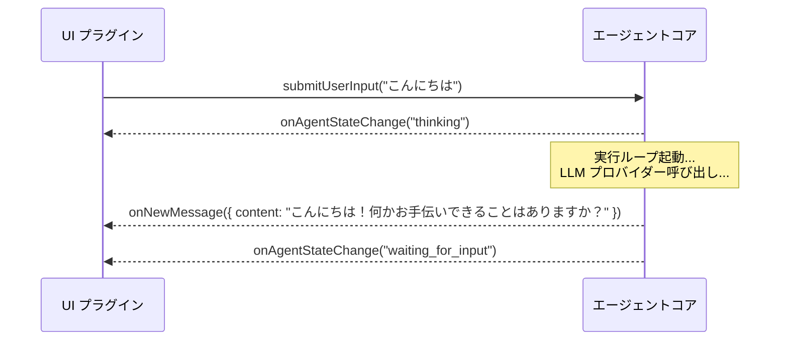
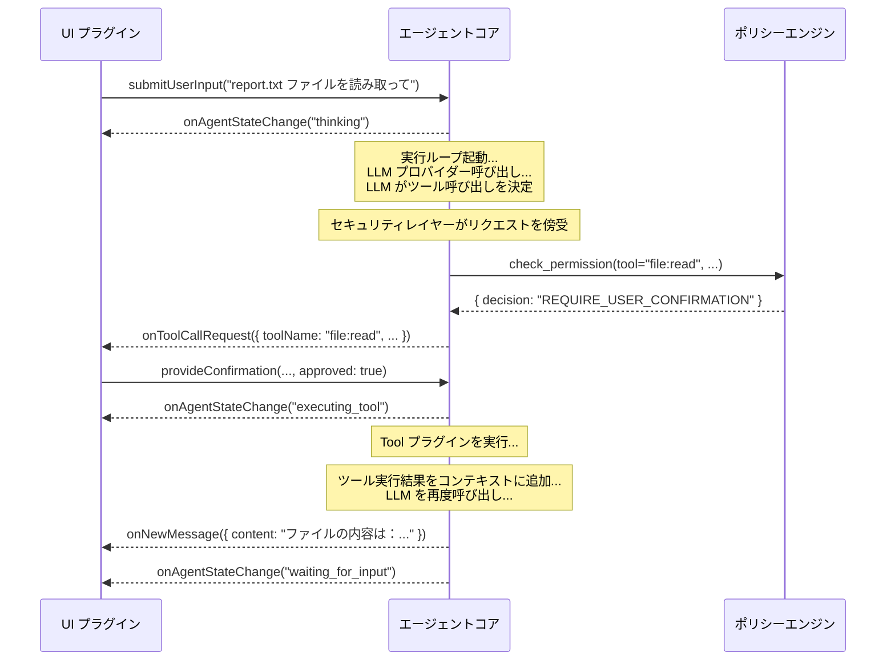

# 深度解析：双方向通信インターフェース (Communication Interface)

このドキュメントでは、コアと UI プラグインの間の「神経系」である双方向通信インターフェースのプロトコル、イベント、およびコマンドの具体的な定義について深く掘り下げます。

## 設計原則

このインターフェースは、コアと UI の疎結合を最大限に実現するために、「イベント駆動」と「コマンドパターン」の設計に従っています。コアはイベントをブロードキャストし、 UI はそれに応答してビューを更新します。 UI はコマンドを送信し、コアはそれに応答してステート（状態）を変更します。

---

## 対話フロー図 (Sequence Diagram)

### シナリオ1：単純な質疑応答


### シナリオ2：ツール呼び出し


---

## インターフェース詳細定義

### コア -> UI イベント

*   **`onNewMessage(payload: object)`**
    *   **データ構造 (Payload)：**
        ```json
        {
          "content": "string",
          "format": "markdown" | "text",
          "metadata": {
            "source_documents": [ /* RAG 結果 */ ],
            "latency_ms": 1200
          }
        }
        ```

*   **`onToolCallRequest(payload: object)`**
    *   **データ構造 (Payload)：**
        ```json
        {
          "confirmationId": "uuid-1234",
          "toolName": "shell:execute",
          "args": { "command": "ls -l" },
          "security_warning": {
            "level": "CRITICAL" | "WARN" | "INFO",
            "message": "エージェントが Shell コマンドを実行しようとしています..."
          }
        }
        ```

### UI -> コア コマンド

*   **`submitUserInput(payload: object)`**
    *   **データ構造 (Payload)：**
        ```json
        {
          "text": "string",
          "attachments": [ // マルチモーダル入力用
            { "type": "image", "data": "base64-encoded-string" }
          ]
        }
        ```
*   **`provideConfirmation(payload: object)`**
    *   **データ構造 (Payload)：**
        ```json
        {
          "confirmationId": "uuid-1234",
          "approved": true | false
        }
        ```
---

## 実装プロトコルの検討 (Implementation Protocols)

*   **モノリシック (Monolithic)：** コアと UI が同じプロセス内で動作している場合（例えば、ローカルのデスクトップ TUI アプリなど）、最もシンプルな実装は、 Node.js の `EventEmitter` のような言語内蔵のイベントメカニズムを使用することです。コアは EventEmitter のインスタンスであり、 UI プラグインは初期化時にそれを監視します。
*   **クライアント/サーバー (Client/Server)：** UI がリモートの Web アプリやモバイルアプリの場合、ネットワークプロトコルが必要です。
    *   **WebSocket：** 持続的な双方向通信チャネルを提供し、コアがいつでも UI にイベントをプッシュできるため、理想的な選択肢です。
    *   **HTTP ロングポーリング/SSE：** 代替案として、リアルタイムのイベントプッシュを実現できます。

---

## セッション隔離アーキテクチャ (Session Isolation Architecture)

> **ステータス：** 📋 計画中 (Plan05.1)

### 問題の背景

現在のアーキテクチャは「ブロードキャスト (Broadcast)」モードです。これは、ユーザー A が WebSocket でエージェントに接続し、同時にユーザー B も接続した場合、二人が互いのメッセージやツール呼び出し結果を見てしまうことを意味します。個人での使用には問題ありませんが、多人数での協調やマルチテナントのシナリオでは、重大なプライバシー上の脆弱性となります。

### 解決策

セッション隔離メカニズムを導入し、各クライアントが自分自身に属するメッセージのみを受信できるようにします。

```
┌─────────────┐     ┌─────────────┐     ┌─────────────┐
│ クライアント A │     │ クライアント B │     │ クライアント C │
│ sessionId:A │     │ sessionId:B │     │ sessionId:C │
└──────┬──────┘     └──────┬──────┘     └──────┬──────┘
       │                   │                   │
       └───────────────────┼───────────────────┘
                           │
                    ┌──────▼──────┐
                    │   Listener  │
                    │ sessionId付与 │
                    └──────┬──────┘
                           │
                    ┌──────▼──────┐
                    │    Core     │
                    │ sessionId透過 │
                    └──────┬──────┘
                           │
                    ┌──────▼──────┐
                    │     UI      │
                    │ sessionIdに  │
                    │ 基づくフィルタ │
                    └─────────────┘
```

### 実装の考え方

1. **Listener レイヤー：** 入力を受信する際、 `sessionId` （例： `ws-client-1` ）を付与します。
   ```typescript
   ctx.pushInput({
     source: "websocket",
     inputType: "user_input",
     data: msg.payload?.text ?? "",
     sessionId: clientId,  // 新設
     replyTo: clientId,
   });
   ```

2. **Core レイヤー：** 処理時に、 `sessionId` を出力イベントに透過させます。
   ```typescript
   interface AgentEvent {
     type: AgentEventType;
     timestamp: number;
     payload: {
       sessionId?: string;  // 新設
       // ...その他のフィールド
     };
   }
   ```

3. **UI レイヤー：** `onEvent` 内で判定とフィルタリングを行います。
   ```typescript
   onEvent(event: AgentEvent): void {
     const sessionId = event.payload?.sessionId;

     if (sessionId && connections.has(sessionId)) {
       // 特定のクライアントへターゲットプッシュ
       const conn = connections.get(sessionId)!;
       conn.ws.send(JSON.stringify(event));
     } else if (!sessionId) {
       // システムブロードキャスト（ sessionId なし）は全員に送信
       for (const conn of connections.values()) {
         conn.ws.send(JSON.stringify(event));
       }
     }
   }
   ```

### 受入基準

- ☐ WebSocket ユーザー A がユーザー B の対話を見ることができないこと
- ☐ システムブロードキャスト（ sessionId なし）をすべてのユーザーが受信できること
- ☐ セッションをまたいでメッセージが漏洩しないこと

### MCP プロトコルとの関係

**これは Plan06 (MCP 統合) へ進むための前提条件です。**

MCP プロトコルのシナリオでは、複数の外部クライアントが同時にエージェントに接続します。セッション隔離がない場合：
- クライアント A がクライアント B のツール実行結果を見てしまう
- データプライバシーの漏洩につながる
- マルチテナントのセキュリティ原則に違反する
