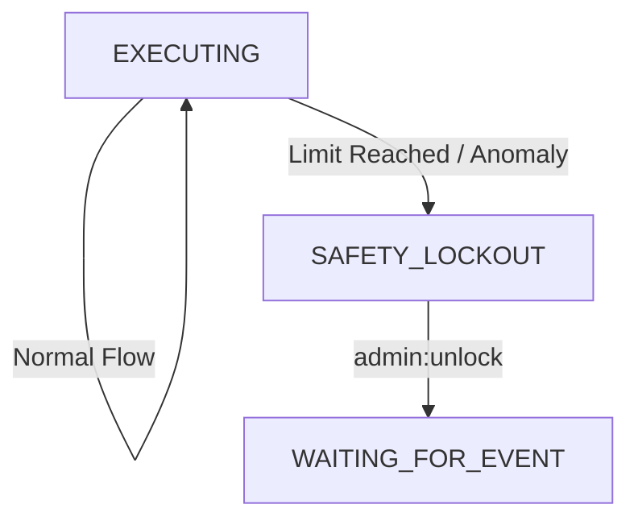

# 15. 安全遮断メカニズムと失控防御 (Safety Circuit Breakers)

このドキュメントでは、 OpenStarry システムの多層的な安全防御体系を定義します。これは、 LLM のハルシネーション（幻覚）、ロジックのデッドロック、または悪意のある入力によって、エージェントがリソース枯渇や危険な操作といった制御不能な状態に陥るのを防ぐことを目的としています。

設計は **「多層防御 (Defense in Depth)」** 原則に従い、防御措置は内部のコアロジックから外部の人間による介入まで、内から外へと展開されます。

---

## レベル 1：リソースレベルの遮断 (Resource Limits)
*目標： API 費用の爆発とシステムリソースの枯渇を防止する。*

これらの制限はハード的なカウンターであり、通常は **`State Manager`** または **`Budget Manager Plugin`** によって強制されます。

### 1.1 Token 予算 (Token Budget)
*   **メカニズム：** 各エージェントインスタンスの起動時に `MAX_TOKEN_USAGE` （例： 100k tokens）が割り当てられます。
*   **執行：** LLM プロバイダーを呼び出すたびに、累積消費量をチェックします。
*   **アクション：** 制限を超えた場合、思考ループを強制終了し、「予算枯渇」信号を送信して `STOPPED` 状態に入ります。

### 1.2 ループ回数上限 (Loop Cap)
*   **メカニズム：** 単一のタスク (Task) 内での `Execution Loop` の最大反復回数を制限します（例： 50回）。
*   **執行：** コアが `tick_index` を維持します。
*   **アクション：** 閾値を超えた場合、「タスクが無限ループに陥った」と見なし、強制的に一時停止して人間の介入を求めます。

---

## レベル 2：行動レベルの遮断 (Behavioral Analysis)
*目標：「無効な繰り返しの試行」または「暴走」を検知して中断する。*

この部分のロジックは比較的複雑で、 **コア内部のヒューリスティック・アルゴリズム** によって実装されます。

### 2.1 重複ツール呼び出し検知 (Repetitive Tool Call Detection)
*   **シナリオ：** LLM が存在しないファイルを読み取ろうとしてエラーが発生したが、エラーを無視して同じファイルを読み取ろうとし続け、無限ループに陥る。
*   **メカニズム：** コアが `ToolCallFingerprint` 履歴キュー（ Tool 名 + 引数のハッシュ）を維持します。
*   **規則：** 同じ指紋の呼び出しが `N` 回（例： 3回）連続し、かつ結果が失敗（ Error ）である場合、遮断をトリガーします。
*   **アクション：** コンテキストにシステムレベルの指示を強制的に挿入します： *"SYSTEM ALERT: You are repeating a failed action. STOP and analyze why."* 再度失敗した場合は、エージェントを終了させます。

### 2.2 エラー連鎖遮断 (Error Cascade Breaker)
*   **シナリオ：** エージェントが無効な JSON 出力を連発する、あるいは存在しないツールを連続して呼び出す。
*   **メカニズム：** スライディングウィンドウ内のエラー率を維持します（例：直近10回の操作のうち8回が異常）。
*   **アクション：** `EMERGENCY_HALT` をトリガーし、エージェントの状態を `ERROR_PAUSED` にして、開発者の確認を待ちます。

---

## レベル 3：コマンドレベルの遮断 (Human Override)
*目標：人間が絶対的かつ即時的な制御権を持つことを保証する。*

これは **`Priority Event Queue`** （詳細は 01_Execution_Loop の改善を参照）を通じて実現されます。

### 3.1 緊急停止信号 (Kill Switch)
*   **メカニズム：** ユーザーまたは管理者が `SYSTEM_HALT` または `STOP` コマンドを送信します。
*   **執行：**
    *   そのコマンドは **Priority 0 (最高優先度)** としてマークされます。
    *   **コアの実行ループ** は、各反復の開始時に、 **優先的に** 高優先度キューをチェックします。
    *   キューに未処理の通常タスクが100個あっても、コアは Halt コマンドを直接処理します。
*   **アクション：** 現在準備中の LLM リクエストを直ちに破棄し、以降のツールは一切実行せず、状態を `STOPPED` に切り替え、イベントキュー内の残りのタスクをクリアします。

---

## アーキテクチャの実装： `SafetyMonitor` コンポーネント

コアを簡潔に保つため、上記のレベル 1 およびレベル 2 のロジックを **`SafetyMonitor`** モジュールにカプセル化することをお勧めします。

*   **位置：** `Agent Core` の内部モジュール（基本的な安全保障であるため、プラグインではありません）。
*   **フックポイント：**
    *   `beforeLLMCall()`: Token 予算をチェック。
    *   `afterToolExecution()`: 重複呼び出しとエラー率をチェック。
    *   `onEventLoopStart()`: Tick 上限をチェック。

### ステートマシンの統合
遮断がトリガーされると、ステートマシンは `EXECUTING` から `SAFETY_LOCKOUT` 状態へ強制的に遷移します。この状態では、ロック解除コマンドを受信するまで、エージェントはいかなるタスクの実行も拒否します。

---

## まとめ

この遮断メカニズムにより、以下が保証されます。
1.  **費用の安全：** バグによって API の枠を使い果たすことがありません。
2.  **システムの安定：** 無限ループによって計算リソースを占有することがありません。
3.  **人間による制御：** エージェントがどれほど忙しくても、人間はいつでも一時停止ボタンを押すことができます。
