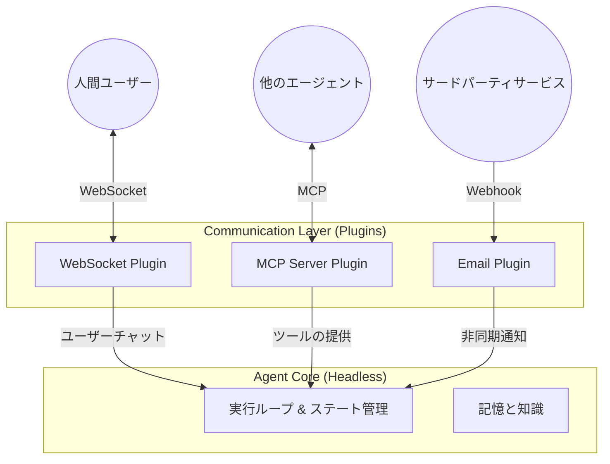

# 08. 通信プロトコル戦略：多角的なアプローチによるオープンアーキテクチャ

このドキュメントでは、OpenStarry システムにおける「通信 (Communication)」に関するコアアーキテクチャの哲学を定義します。私たちは特定の伝送プロトコルを強制することはありません。代わりに、通信能力を完全にプラグインレイヤーに委ねています。

## コア哲学：プラグインとしての通信 (Communication as a Plugin)

OpenStarry において、 **エージェントコアは「プロトコルにとらわれない (Protocol Agnostic)」** です。コアは内部の「イベント (Events)」と「意図 (Intents)」のみを理解し、外部世界がどのような方法で自身と通信しているかを知りません。

人間とのチャットであれ、他のマシンとの連携であれ、すべての外部通信は **通信プラグイン (Communication Plugin)** を介して適応させる必要があります。

この設計により、1つのエージェントは「多頭 (Multi-headed)」の実体になることができます。つまり、同じ時間に、複数の異なるチャネルやプロトコルを通じて、異なる対象と対話することが可能です。

---

## 通信プラグインの分類

多様な通信ニーズをより適切に管理するために、通信プラグインを大きく2つのカテゴリに分類しています。

### 1. チャネルプラグイン (Channel Plugins) - 対人間・業務向け
このカテゴリのプラグインは、主に **非構造化または半構造化** された対話を処理し、通常は「会話 (Conversation)」をシミュレートします。

*   **対象：** 人間ユーザー、チャットボットプラットフォーム、通知システム。
*   **対話モード：** 
    *   **インバウンド (Inbound):** 外部メッセージ (テキスト/画像) を `core.submitUserInput()` に変換します。
    *   **アウトバウンド (Outbound):** `onNewMessage` イベントを監視し、それをテキストやカードとしてレンダリングして送信します。
*   **典型的な例：**
    *   **WebSocket / HTTP Server:** Web UI やモバイルアプリ用。
    *   **WhatsApp / Telegram / Discord アダプター:** インスタントメッセージングソフト用。
    *   **Email リスナー:** メールによる非同期通信。
    *   **音声インターフェース:** 音声認識 (STT) および音声合成 (TTS) インターフェース。

### 2. プロトコルプラグイン (Protocol Plugins) - 対マシン・機能向け
このカテゴリのプラグインは、 **高度に構造化** されたデータ交換を処理し、通常は「リモートプロシージャコール (RPC)」または「リソースアクセス」をシミュレートします。

*   **対象：** 他のエージェント、レガシーシステム、マイクロサービス、IDE、データベース。
*   **対話モード：** 
    *   **サーバーとして (呼び出される側):** 外部リクエストを `core.executeTool()` (能力の直接実行) にマッピングするか、特定のシステムコマンドをトリガーします。
    *   **クライアントとして (能動的に呼び出す側):** エージェントの `Tool Call` の意図を特定のネットワークリクエスト (HTTP Request, MCP Packet, gRPC Call) に変換します。
*   **典型的な例：**
    *   **MCP (Model Context Protocol):** **(推奨標準)** 標準化されたツールの相互運用とリソース共有に使用されます。
    *   **REST API アダプター:** エージェントを一連の RESTful エンドポイントとして公開します。
    *   **ActivityPub:** エージェントをフェディバース (Fediverse) の1つのノードにします。
    *   **カスタムバイナリプロトコル:** 高頻度取引や低遅延シナリオ向けの専用プロトコル。

---

## 多頭エージェントモデル (The Multi-headed Agent Model)

強力な OpenStarry エージェントは、通常、複数の通信プラグインを同時にロードし、「多頭」の形態をとります。

### シナリオ例：万能アシスタント

ある「万能ビジネスアシスタント・エージェント」は、次のように構成できます。
1.  **WebSocket Plugin:** ユーザーのスマートフォンアプリに接続し、ユーザーがいつでも音声で指示を出せるようにします。
2.  **MCP Client Plugin:** 会社の「データベース検索 MCP サーバー」に接続し、販売データを取得します。
3.  **Slack Adapter Plugin:** 会社の Slack ワークスペースに参加し、同僚からの `@mention` を監視して自動的に返信します。

このシナリオでは、コアは WebSocket、MCP、Slack の3つのプロトコルを同時に処理していることを知る必要はありません。コアは単に入力を受け取り、考え、出力を生成し続けるだけです。各プラグインが、それらの出力を正しいチャネルに分配する責任を負います。

---

## MCP の特別な地位

私たちは複数のプロトコルをサポートしていますが、 **MCP (Model Context Protocol)** をエコシステムにおける **最優先の市民 (First-class Citizen)** と見なしています。

*   **なぜか？** MCP は AI 時代のために特別に設計されており、従来の REST や WebSocket ではエレガントに解決するのが難しかった「プロンプトの長さ制限」や「コンテキストの動的なロード」といった問題を解決しているからです。
*   **戦略：** エージェント間 (Agent-to-Agent) およびエージェントとツール間 (Agent-to-Tool) のデフォルト標準として MCP を使用することを推奨しますが、強制ではありません。詳細は `../Plugin_Infrastructure_Examples/02_MCP_Protocol_Integration.md` を参照してください。