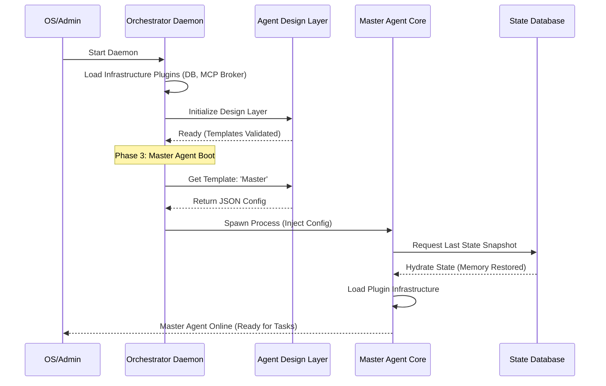

# 13. システム起動シーケンスと引導ロジック (System Boot Sequence)

このドキュメントでは、OpenStarry システムにおける「守護層 (Daemon)」、「設計層 (Design Layer)」、および「コア層 (Agent Core)」のコールドブート時および実行時のロード順序と依存関係を定義します。

## 核心的な依存チェーン

システムの起動は、以下のロジックチェーンに従う必要があります。
**物理環境の準備完了 -> デーモン管理の起動 -> エージェントのブループリント (テンプレート) の取得 -> エージェント実体の孵化 -> 履歴状態の復元。**

---

## 起動フェーズの詳細

### フェーズ1：守護層の起動 (Daemon Layer Boot)
これはシステムの「上帝プロセス」の起動フェーズです。

1.  **Orchestrator Daemon の起動**: オペレーティングシステム（systemd やサービススクリプトなど）によって Daemon プロセスが起動されます。
2.  **インフラプラグインのロード**: Daemon は設定に基づき、「インフラプラグイン (Infrastructure Plugins)」をロードして起動します。これには、ローカルの MCP メッセージブローカー (Broker) の起動や、状態データベースサービス (State DB Service) の初期化が含まれる場合があります。Daemon 自体は特定のミドルウェアロジックをハードコードしません。
3.  **状態チェック**: Daemon は以前の実行ログをスキャンし、復元が必要な異常中断がないかを確認します。

### フェーズ2：設計層の準備完了 (Design Layer Ready)
エージェントを作成する前に、まずそれらの「遺伝子プール」を準備する必要があります。

1.  **Agent Design Layer サービスのオンライン化**: 設計層 API サービスを起動します（またはローカルのテンプレートディレクトリを初期化します）。
2.  **テンプレートの検証**: すべてのエージェントテンプレート (Agent Templates) をスキャンし、JSON 形式とツールの定義が正当であることを検証します。
3.  **クエリインターフェースの提供**: Daemon からの構成クエリリクエスト（例： `GET /templates/master-agent`）に応答する準備を整えます。

### フェーズ3：マスターエージェントの引導 (Master Agent Bootstrapping)
これはシステムが最初のインテリジェントな実体を生成するプロセスです。

1.  **ブループリントの取得**: Daemon は設計層に対して「マスターエージェント (Master Agent)」の詳細な構成を要求します。
2.  **プロセスの孵化 (Spawn)**: Daemon は構成に基づいて、 **Agent Core** を実行するための新しい OS プロセスを作成します。
3.  **コアの自己初期化**:
    *   **インフラのロード**: Agent Core は内部のプラグインローダーを初期化します。
    *   **記憶の復元**: Core は Daemon が提供するインターフェースを介して、状態データベースから最後の `State Snapshot`（存在する場合）を読み取ります。
    *   **リスナー (Listeners) のロード**: UI または Webhook プラグインを起動し、正式に外部との通信を開始します。

### フェーズ4：ワーカーエージェントのオンデマンド作成 (Worker Agents on Demand)
システムは実行時に入り、タスクのニーズに応じて動的に拡張します。

1.  **意思決定の委任**: マスターエージェント (Master Agent) はタスクに協力が必要であると判断し、 `AgentManagerTool` を呼び出します。
2.  **孵化のリクエスト**: `AgentManagerTool` は Daemon に作成リクエストを送信します。
3.  **ワーカーのブループリント取得**: Daemon は設計層に対応するワーカーテンプレートを要求します。
4.  **プロセスの孵化**: Daemon はワーカーエージェントのプロセスを作成し、フェーズ3の初期化フローを繰り返します（ただし、通常はより軽量です）。

5.  **Core Loop の実行：** `Core.start()` を呼び出します。

---

## 3. カーネル引導メカニズム：ホスト引導パターン (Host Bootstrapping Pattern)

「純粋なカーネル」が自ら構成を読み取ることができないというパラドックスを解決するために、私たちはホスト引導パターンを採用しています。

### 役割分担 (The Division of Labor)

*   **Host (ホスト/調整レイヤー):** 
    *   **環境：** ネイティブな OS 権限を持つ Node.js プロセス。
    *   **タスク：** `agent.json` の読み取り、ハードディスクディレクトリのスキャン、プラグインコードの物理的なロード ( `require/import` )。
*   **Core (カーネル):** 
    *   **環境：** 完全に純粋なロジックコンテナ。
    *   **タスク：** Host から提供されたプラグインモジュールを受け取り、初期化を実行し、思考を開始します。

### 引導シーケンス (The Micro Sequence)

1.  **Host の目覚め：** `openstarry start` を実行し、Host プロセスが起動します。
2.  **Host の準備：** Host は設定ファイルに基づき、必要なプラグインをハードディスクからメモリに「取得」します。
3.  **魂の注入：** Host は `AgentCore` インスタンスを作成し、「取得した能力」を渡します。
4.  **Core の運転：** Core は自身に能力が付与されたことを認識し、タスクの実行を開始します。

**これにより、カーネルのクロスプラットフォーム性が保証されます。ホストが対応する能力プラグインを提供できる限り、カーネルはどのような環境でも動作できます。**

---

## 重要な規則

*   **一意性**: 同一時間において、同じ ID のエージェントに対して Daemon が管理できるアクティブなプロセスは1つだけです。
*   **構成の不変性**: エージェントの起動後、そのコア構成（ブループリント）はそのライフサイクル内では変更できません。構成を更新する場合は、プロセスを再起動する必要があります。
*   **縮退起動**: 設計層サービスが利用できない場合、Daemon は基本動作を維持するためにローカルにキャッシュされたテンプレートのロードを試みるべきです。