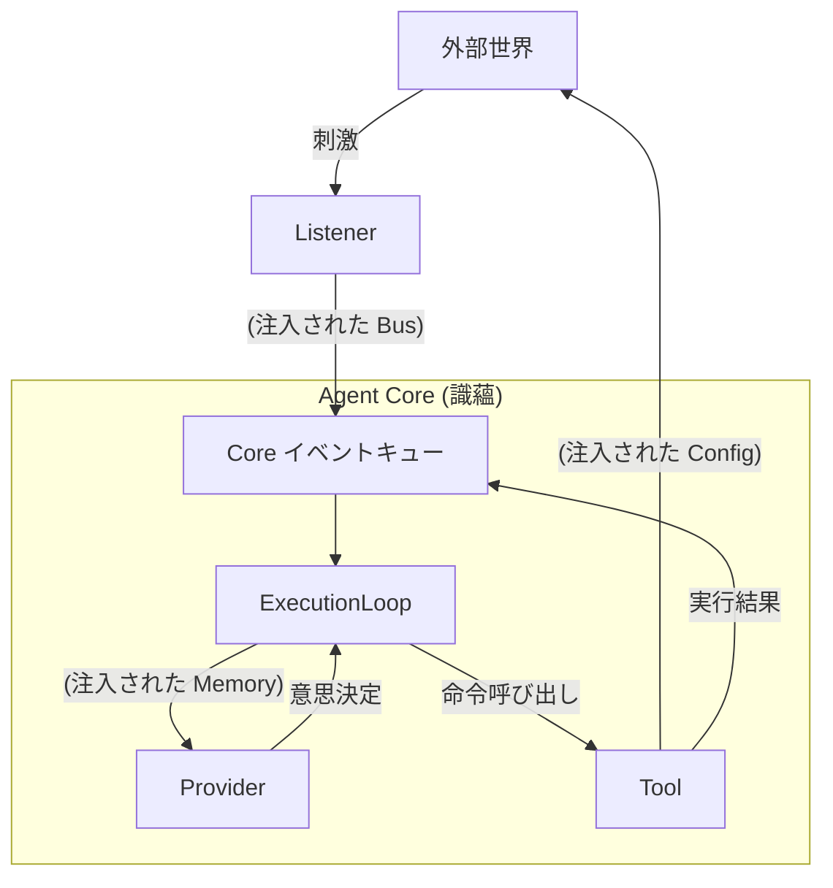

# 20. 依存関係の編み込みと制御ループ (Dependency Wiring & Control Loop)

このドキュメントでは、 **調整レイヤー (Coordination Layer)** が精密な **依存性の注入 (Dependency Injection)** メカニズムを通じて、孤立した五蘊プラグインをどのようにつなぎ合わせ、連続的で生命力のある制御ループを構築するかを深く掘り下げます。

## 1. コアコンセプト：部品から有機体へ

エージェントは精密機器のようなものです。
*   **プラグイン (Plugins)** は、バラバラの部品（歯車、モーター、センサー）です。
*   **コア (識蘊)** は、筐体と主軸です。
*   **依存性の注入** は、これらの部品を正しい位置に取り付け、ネジを締めるプロセスです。

正しい注入がなければ、リスナーは音を聞き取ってもそれを脳に伝えることができず、プロバイダーは対策を考えても手足を動かすことができません。

---

## 2. 調整レイヤーの編み込みタスク (The Wiring Tasks)

エージェントが起動する際、調整レイヤー（またはその委託を受けたローダー）は以下の「編み込み」アクションを実行します。

### A. 感覚ループの接合 (Wiring the Senses)
*   **対象：** `Listener` (受蘊)
*   **注入物：** `EventBus` (イベントバス)
*   **目的：** 外部の刺激がコア内部の `Input Event` に変換されるようにします。
*   **ロジック：**
    ```typescript
    // ローダーの疑似コード
    listener.initialize({
      // コールバック関数を注入し、リスナーがコアの神経衝動をトリガーできるようにする
      emitInput: (data) => core.eventQueue.push(data)
    });
    ```

### B. 認知ループの接合 (Wiring the Mind)
*   **対象：** `Provider` (想蘊)
*   **注入物：** `Memory` (記憶) & `Context`
*   **目的：** 思考に連続性と文脈（コンテキスト）を持たせます。
*   **ロジック：** プロバイダー自身は状態を保持しません。コアから注入された `context.memory` に依存して過去の対話を遡ります。

### C. 行動ループの接合 (Wiring the Limbs)
*   **対象：** `Tool` (行蘊)
*   **注入物：** `Config` (設定と権限) & `Logger`
*   **目的：** 行動が認可されたものであること、および結果を追跡可能にすることを保証します。
*   **ロジック：**
    ```typescript
    tool.initialize({
      config: { apiKey: "...", rootDir: "/safe/path" }, // セキュリティ境界の注入
      logger: core.logger.child({ scope: "Tool:FS" })   // 監視の注入
    });
    ```

### D. プラグイン間サービスの接合 (Wiring Cross-Plugin Services)
*   **対象：** 他のプラグインに依存するコンポジットプラグイン（Workflow など）。
*   **注入物：** `dependencies` オブジェクト。
*   **ロジック：**
    *   調整レイヤーはまず `SkillPlugin` を初期化し、その `MarkdownParser` インスタンスを取得します。
    *   `WorkflowPlugin` の初期化時に、そのインスタンスを `context.dependencies['standard-function-skill']` に注入します。
    *   これにより、機能モジュール間の **水平的な協調** が保証されます。

---

## 3. 形成された制御ループ (The Resulting Loop)

上記の編み込みを経て、標準的な OODA (Observe-Orient-Decide-Act) ループが形成されます。



## 4. 断線の診断 (Troubleshooting Broken Loops)

調整レイヤーはループの完全性の監視も担当します。起動時のチェックで以下が発見された場合：
*   **リスナーはあるがプロバイダーがない：** これは「植物状態」（聞くことはできるが考えられない）であり、警告を発します。
*   **プロバイダーはあるがリスナーがない：** これは「脳のみ」の状態（考えることはできるが入力がない）であり、純粋なタスク型エージェントでない限り、設定エラーと見なされます。
*   **ツールに設定が必要だが注入が空：** これは「麻痺」状態であり、起動に失敗します。

## 5. まとめ

依存性の注入は単なるプログラミングの手法ではありません。それは **エージェントの神経外科手術** です。調整レイヤーは、精密な注入を通じて、五蘊皆空（コンポーネントの疎結合）を実現すると同時に、五蘊熾盛（機能の協調）を確保し、エージェントを一つの生きた有機体にします。
*   **依存注入のタイミング**：他のプラグインをまたぐサービス（ `markdownParser` など）は、フェーズ B のソート過程で動的に注入される必要があります。
*   `@openstarry-plugin/skill` の初期化が完了すると、そのサービスインスタンスを返し（または登録し）ます。
*   ローダーはこれらのインスタンスをキャッシュします。
*   `@openstarry-plugin/workflow` の初期化の番が来ると、ローダーはキャッシュから `markdownParser` を取り出し、 `context.dependencies` に入れます。
