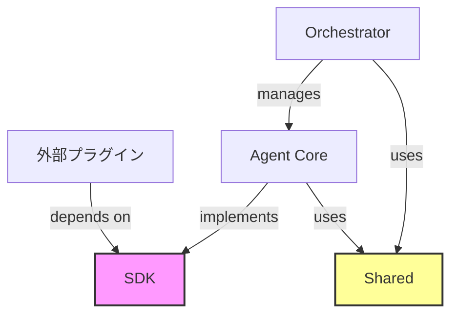

# 03. SDK および共有ライブラリ構造仕様 (Shared Libraries & SDK Structure)

このドキュメントでは、 `packages/sdk` と `packages/shared` の内部構造と責務を定義します。これら2つのライブラリは OpenStarry エコシステムの礎石であり、コア (Core) とプラグイン (Plugins) の間の疎結合を保証します。

## 1. `packages/sdk` (The Public Contract)

**位置付け：** これは OpenStarry が外部に公開する「法的契約」です。
**原則：**
*   **依存性ゼロ (Zero Dependencies)：** SDK はいかなるランタイムロジックにも依存すべきではありません。型定義、抽象クラス (Abstract Classes) 、および軽量な DTO のみを含みます。
*   **プラグイン開発者の必須アイテム：** サードパーティのプラグイン開発者は、 `@openstarry/sdk` をインストールするだけで開発が可能であり、コアをインストールする必要はありません。

### ディレクトリ構造

```text
sdk/
├── src/
│   ├── types/              # 純粋な TypeScript 型定義
│   │   ├── agent.ts        # IAgent, IAgentConfig
│   │   ├── message.ts      # IMessage, Role
│   │   ├── tool.ts         # ITool, ToolCallRequest
│   │   └── plugin.ts       # IPlugin, IPluginContext
│   ├── interfaces/         # コアコンポーネントの動作インターフェース
│   │   ├── llm.ts          # ILanguageModelProvider
│   │   └── storage.ts      # IVectorStore, IKeyValueStore
│   ├── errors/             # 標準エラー定義（エラー型の統一を保証）
│   │   └── base.ts         # AgentError, ToolExecutionError
│   └── index.ts            # 統合エクスポート
└── package.json
```

### 主要な型定義の例

TypeScript のインターフェースを使用して「契約」を定義します：

```typescript
// プラグインが実装しなければならないインターフェース
export interface IPlugin {
  id: string;
  name: string;
  version: string;
  initialize(context: IPluginContext): Promise<void>;
  shutdown(): Promise<void>;
}

// コアからプラグインに渡されるコンテキスト（制限された権限）
export interface IPluginContext {
  logger: ILogger;
  config: Record<string, any>;
  registerTool(tool: ITool): void;
  registerListener(listener: IListener): void;
}
```

---

## 2. `packages/shared` (Common Utilities)

**位置付け：** これはシステム内部の「ツールボックス」であり、 `packages/core` と `apps/daemon` で共有されます。
**原則：**
*   **ステートレス (Stateless)：** ここにある関数は純粋関数 (Pure Functions) であるべきです。
*   **クロスプラットフォーム：** コードは Node.js とブラウザ環境の両方で動作可能であるべきです（ `fs`, `net` などの特定のモジュールへの依存を可能な限り避けるか、それらをカプセル化します）。

### ディレクトリ構造

```text
shared/
├── src/
│   ├── logger/             # 構造化ログのカプセル化 (Pino/Winston Wrapper)
│   ├── utils/              # 共通ユーティリティ関数
│   │   ├── uuid.ts         # ID 生成器
│   │   ├── sleep.ts        # 非同期待機
│   │   └── validation.ts   # Zod/Joi スキーマ検証ヘルパー
│   ├── constants/          # システムレベルの定数
│   │   └── events.ts       # コアイベント名の定義 (Event Topics)
│   └── index.ts
└── package.json
```

---

## 3. 依存関係図 (Dependency Graph)

この図は、これら2つのパッケージがアーキテクチャの中でどのような位置にあるかを示しています：



*   **SDK** は最下層であり、最も安定しています。
*   **Shared** は中間層であり、利便性を提供します。
*   **Core** は実装層であり、上記の2つに依存します。
