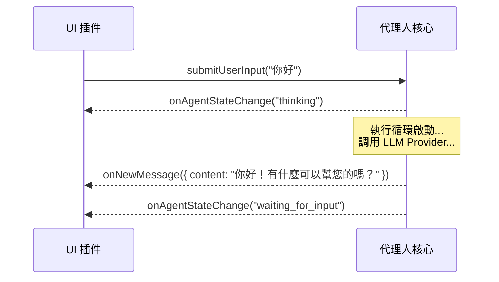
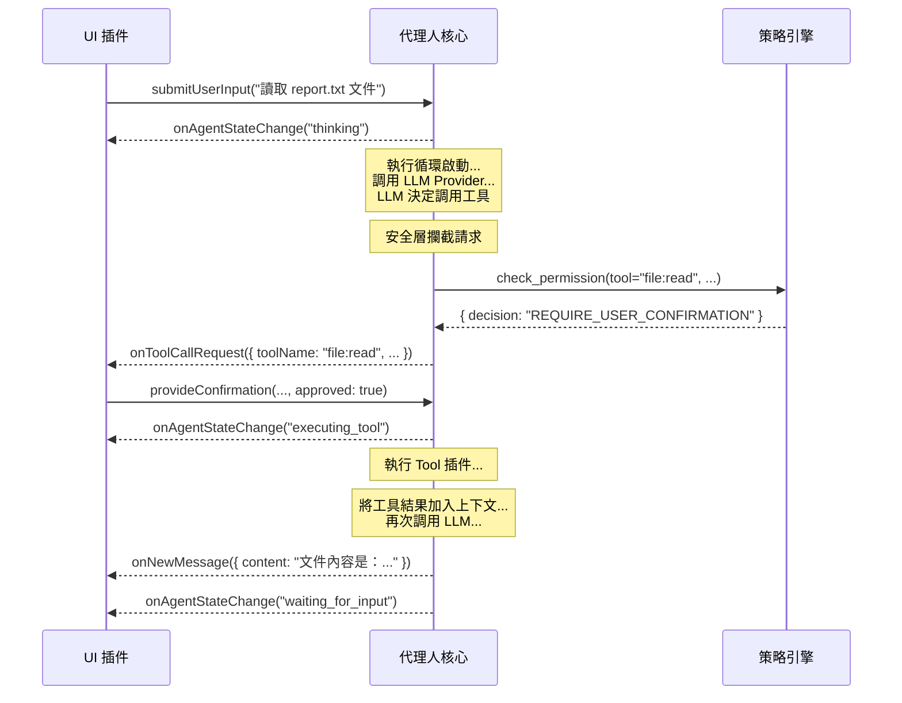

# 深度解析：雙向通信接口

本文件深入探討核心與 UI 插件之間的「神經系統」——雙向通信接口的協議、事件和命令的具體定義。

## 設計原則

該接口遵循「事件驅動」和「命令模式」的設計，以實現核心與 UI 的最大程度解耦。核心廣播事件，UI 響應事件來更新視圖；UI 發送命令，核心響應命令來改變狀態。

---

## 交互流程圖 (Sequence Diagram)

### 場景一：簡單問答


### 場景二：工具調用


---

## 接口詳細定義

### 核心 -> UI 事件

*   **`onNewMessage(payload: object)`**
    *   **數據結構 (Payload):**
        ```json
        {
          "content": "string",
          "format": "markdown" | "text",
          "metadata": {
            "source_documents": [ /* RAG 結果 */ ],
            "latency_ms": 1200
          }
        }
        ```

*   **`onToolCallRequest(payload: object)`**
    *   **數據結構 (Payload):**
        ```json
        {
          "confirmationId": "uuid-1234",
          "toolName": "shell:execute",
          "args": { "command": "ls -l" },
          "security_warning": {
            "level": "CRITICAL" | "WARN" | "INFO",
            "message": "代理人正試圖執行一個 Shell 命令..."
          }
        }
        ```

### UI -> 核心 命令

*   **`submitUserInput(payload: object)`**
    *   **數據結構 (Payload):**
        ```json
        {
          "text": "string",
          "attachments": [ // 用於支持多模態輸入
            { "type": "image", "data": "base64-encoded-string" }
          ]
        }
        ```
*   **`provideConfirmation(payload: object)`**
    *   **數據結構 (Payload):**
        ```json
        {
          "confirmationId": "uuid-1234",
          "approved": true | false
        }
        ```
---

## 實現協議探討 (Implementation Protocols)

*   **單體應用 (Monolithic):** 如果核心和 UI 在同一個進程中運行（例如，一個本地的桌面 TUI 應用），最簡單的實現是使用語言內置的事件機制，如 Node.js 的 `EventEmitter`。核心是一個 EventEmitter 實例，UI 插件在初始化時對其進行監聽。
*   **客戶端/服務器 (Client/Server):** 如果 UI 是一個遠程的 Web 應用或移動 App，則需要使用網絡協議。
    *   **WebSocket:** 是理想的選擇，因為它提供了持久的雙向通信通道，核心可以隨時向 UI 推送事件。
    *   **HTTP長輪詢/SSE:** 作為備選方案，也可以實現實時的事件推送。

---

## Session 隔離架構 (Session Isolation Architecture)

> **狀態：** 📋 規劃中 (Plan05.1)

### 問題背景

目前的架構是「廣播 (Broadcast)」模式。這意味著：如果用戶 A 用 WebSocket 連接 Agent，同時用戶 B 也連接，兩人會看到彼此的訊息和工具調用結果。這在單人使用時沒問題，但在多人協作或多租戶場景下是嚴重隱私漏洞。

### 解決方案

引入 Session 隔離機制，確保每個客戶端只收到屬於自己的訊息。

```
┌─────────────┐     ┌─────────────┐     ┌─────────────┐
│ Client A    │     │ Client B    │     │ Client C    │
│ sessionId:A │     │ sessionId:B │     │ sessionId:C │
└──────┬──────┘     └──────┬──────┘     └──────┬──────┘
       │                   │                   │
       └───────────────────┼───────────────────┘
                           │
                    ┌──────▼──────┐
                    │   Listener  │
                    │ 標記sessionId │
                    └──────┬──────┘
                           │
                    ┌──────▼──────┐
                    │    Core     │
                    │ 透傳sessionId │
                    └──────┬──────┘
                           │
                    ┌──────▼──────┐
                    │     UI      │
                    │ 依sessionId  │
                    │  過濾推送   │
                    └─────────────┘
```

### 實作思路

1. **Listener 層：** 接收輸入時，標記 `sessionId`（例如 `ws-client-1`）
   ```typescript
   ctx.pushInput({
     source: "websocket",
     inputType: "user_input",
     data: msg.payload?.text ?? "",
     sessionId: clientId,  // 新增
     replyTo: clientId,
   });
   ```

2. **Core 層：** 處理時，將 `sessionId` 透傳到輸出事件
   ```typescript
   interface AgentEvent {
     type: AgentEventType;
     timestamp: number;
     payload: {
       sessionId?: string;  // 新增
       // ...其他欄位
     };
   }
   ```

3. **UI 層：** 在 `onEvent` 中判斷過濾
   ```typescript
   onEvent(event: AgentEvent): void {
     const sessionId = event.payload?.sessionId;

     if (sessionId && connections.has(sessionId)) {
       // 定向推送給特定客戶端
       const conn = connections.get(sessionId)!;
       conn.ws.send(JSON.stringify(event));
     } else if (!sessionId) {
       // 系統廣播（無 sessionId）推送給所有人
       for (const conn of connections.values()) {
         conn.ws.send(JSON.stringify(event));
       }
     }
   }
   ```

### 驗收標準

- ☐ WebSocket 用戶 A 看不到用戶 B 的對話
- ☐ 系統廣播（無 sessionId）所有用戶都能收到
- ☐ 訊息不會跨 Session 洩漏

### 與 MCP 協議的關係

**這是進入 Plan06 (MCP 整合) 的前置條件。**

MCP 協議場景中會有多個外部客戶端同時連接 Agent。若無 Session 隔離：
- Client A 會看到 Client B 的工具調用結果
- 造成資料隱私洩漏
- 違反多租戶安全原則
