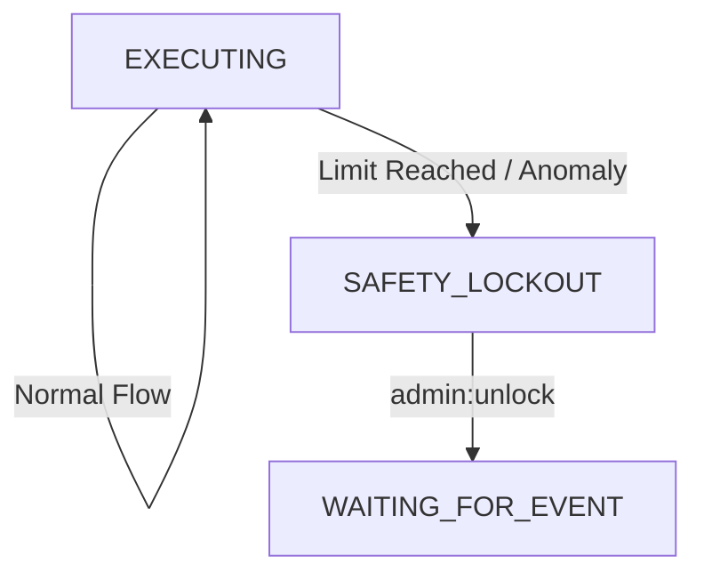

# 15. 安全熔斷機制與失控防禦 (Safety Circuit Breakers)

本文件定義了 OpenStarry 系統的多層次安全防禦體系，旨在防止代理人因 LLM 幻覺、邏輯死鎖或惡意輸入而陷入資源耗盡或危險操作的失控狀態。

設計遵循 **「分層防禦 (Defense in Depth)」** 原則，防禦措施由內而外，從核心邏輯到人類干預。

---

## Level 1: 資源級熔斷 (Resource Limits)
*目標：防止API費用爆炸與系統資源耗盡。*

這些限制是硬性的計數器，通常由 **`State Manager`** 或 **`Budget Manager Plugin`** 強制執行。

### 1.1 Token 預算 (Token Budget)
*   **機制：** 每個代理人實例在啟動時分配一個 `MAX_TOKEN_USAGE` (例如 100k tokens)。
*   **執行：** 每次調用 LLM Provider 前，檢查累計消耗。
*   **動作：** 一旦超限，強制終止思考循環，發送「預算耗盡」信號並進入 `STOPPED` 狀態。

### 1.2 循環次數上限 (Loop Cap)
*   **機制：** 限制單個任務 (Task) 內 `Execution Loop` 的最大迭代次數 (例如 50 次)。
*   **執行：** 核心維護 `tick_index`。
*   **動作：** 超過閾值，視為「任務陷入無限循環」，強制暫停並請求人類介入。

---

## Level 2: 行為級熔斷 (Behavioral Analysis)
*目標：檢測並中斷「無效的重複嘗試」或「發瘋」。*

這部分邏輯較為複雜，由 **Core 內部的啟發式算法** 實現。

### 2.1 重複工具調用檢測 (Repetitive Tool Call Detection)
*   **場景：** LLM 嘗試讀取一個不存在的文件，報錯，然後它無視錯誤，繼續嘗試讀取同一個文件，無限循環。
*   **機制：** 核心維護一個 `ToolCallFingerprint` 歷史隊列 (Hash of ToolName + Args)。
*   **規則：** 如果連續 `N` 次 (例如 3 次) 調用產生了相同的指紋且結果為失敗 (Error)，觸發熔斷。
*   **動作：** 強制向 Context 中插入一條系統級指令：*"SYSTEM ALERT: You are repeating a failed action. STOP and analyze why."* 若再次失敗，則終止代理人。

### 2.2 錯誤級聯熔斷 (Error Cascade Breaker)
*   **場景：** 代理人連續產生無效的 JSON 輸出，或連續調用不存在的工具。
*   **機制：** 維護一個滑動窗口內的錯誤率 (例如：最近 10 次操作中有 8 次異常)。
*   **動作：** 觸發 `EMERGENCY_HALT`，將代理人狀態置為 `ERROR_PAUSED`，等待開發者檢查。

---

## Level 3: 指令級熔斷 (Human Override)
*目標：確保人類擁有絕對的、即時的控制權。*

這是透過 **`Priority Event Queue`** (詳見 01_Execution_Loop 改進) 實現的。

### 3.1 緊急停止信號 (Kill Switch)
*   **機制：** 用戶或管理員發送 `SYSTEM_HALT` 或 `STOP` 指令。
*   **執行：**
    *   該指令被標記為 **Priority 0 (最高優先級)**。
    *   **核心執行循環** 在每次迭代開始時，**優先檢查** 高優先級隊列。
    *   即使隊列中還有 100 個待處理的普通任務，核心也會直接處理 Halt 指令。
*   **動作：** 立即丟棄當前正在準備的 LLM 請求，不執行任何後續工具，將狀態切換為 `STOPPED`，並清除事件隊列中的剩餘任務。

---

## 架構實現：`SafetyMonitor` 組件

為了保持核心整潔，建議將上述 Level 1 和 Level 2 的邏輯封裝在一個 **`SafetyMonitor`** 模塊中。

*   **位置：** `Agent Core` 的內部模塊 (非插件，因為它是基礎安全保障)。
*   **Hook 點：**
    *   `beforeLLMCall()`: 檢查 Token 預算。
    *   `afterToolExecution()`: 檢查重複調用和錯誤率。
    *   `onEventLoopStart()`: 檢查 Tick 上限。

### 狀態機整合
當熔斷觸發時，狀態機從 `EXECUTING` 強制跳轉至 `SAFETY_LOCKOUT` 狀態。此狀態下，代理人拒絕執行任何任務，直到收到解鎖指令。

---

## 總結

這套熔斷機制確保了：
1.  **錢包安全:** 不會因為 Bug 燒光 API 額度。
2.  **系統穩定:** 不會因為無限循環佔用計算資源。
3.  **人類可控:** 無論代理人多忙，人類隨時可以按下暫停鍵。
