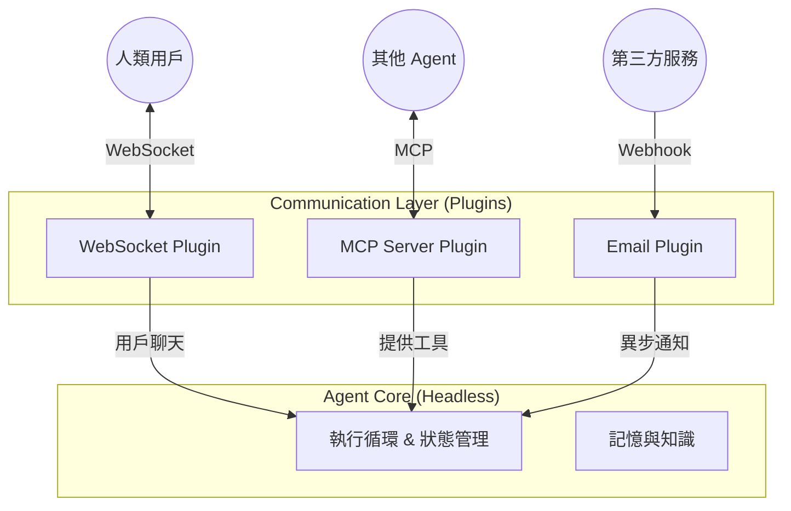

# 08. 通訊協議策略：多頭並進的開放架構

本文件定義了 OpenStarry 系統中關於「通訊 (Communication)」的核心架構哲學。我們不強制綁定任何單一的傳輸協議，而是將通訊能力完全下放給插件層。

## 核心哲學：通訊即插件 (Communication as a Plugin)

在 OpenStarry 中，**Agent Core 是「協議中立 (Protocol Agnostic)」的**。核心只理解內部的「事件 (Events)」與「意圖 (Intents)」，而不知道外部世界是通過什麼方式與它溝通的。

所有的外部通訊——無論是與人類的聊天，還是與其他機器的協作——都必須通過**通訊插件 (Communication Plugin)** 來進行適配。

這種設計使得一個 Agent 可以成為「多頭 (Multi-headed)」實體：它可以在同一時間，通過多種不同的渠道和協議，與不同的對象進行互動。

---

## 通訊插件的分類光譜

為了更好地治理多樣化的通訊需求，我們將通訊插件分為兩大類：

### 1. 渠道插件 (Channel Plugins) - 面向人類與業務
這類插件主要處理**非結構化或半結構化**的交互，通常模擬「對話 (Conversation)」。

*   **目標對象：** 人類用戶、聊天機器人平台、通知系統。
*   **交互模式：** 
    *   **Inbound:** 將外部消息 (Text/Image) 轉換為 `core.submitUserInput()`。
    *   **Outbound:** 監聽 `onNewMessage` 事件，將其渲染為文本或卡片發送出去。
*   **典型範例：**
    *   **WebSocket / HTTP Server:** 用於 Web UI 或移動 App。
    *   **WhatsApp / Telegram / Discord Adapter:** 用於即時通訊軟體。
    *   **Email Listener:** 通過郵件進行異步溝通。
    *   **Voice Interface:** 語音轉文字 (STT) 與文字轉語音 (TTS) 接口。

### 2. 協議插件 (Protocol Plugins) - 面向機器與能力
這類插件處理**高度結構化**的數據交換，通常模擬「遠程過程調用 (RPC)」或「資源訪問」。

*   **目標對象：** 其他 Agent、遺留系統、微服務、IDE、數據庫。
*   **交互模式：** 
    *   **As Server (被調用):** 將外部請求映射為 `core.executeTool()` (直接執行能力) 或觸發特定的系統指令。
    *   **As Client (主動調用):** 將 Agent 的 `Tool Call` 意圖轉換為特定的網絡請求 (HTTP Request, MCP Packet, gRPC Call)。
*   **典型範例：**
    *   **MCP (Model Context Protocol):** **(推薦標準)** 用於標準化的工具互操作與資源共享。
    *   **REST API Adapter:** 將 Agent 暴露為一組 RESTful Endpoint。
    *   **ActivityPub:** 讓 Agent 成為聯邦宇宙 (Fediverse) 中的一個節點。
    *   **Custom Binary Protocol:** 用於高頻交易或低延遲場景的專有協議。

---

## 多頭代理人模型 (The Multi-headed Agent Model)

一個強大的 OpenStarry Agent 通常會同時加載多個通訊插件，形成「多頭」形態：

### 場景示例：全能助理

一個「全能商務助理 Agent」可以這樣配置：
1.  **WebSocket Plugin:** 連接用戶的手機 App，讓用戶可以隨時語音下指令。
2.  **MCP Client Plugin:** 連接公司的「數據庫檢索 MCP Server」，獲取銷售數據。
3.  **Slack Adapter Plugin:** 加入公司的 Slack 工作群，監聽同事的 `@mention` 並自動回覆。

在這個場景中，Core 不需要知道它正在同時處理 WebSocket、MCP 和 Slack 三種協議。它只是不斷地接收 `Input`，思考，然後產生 `Output`。是各個插件負責將這些 Output 分發回正確的渠道。

---

## MCP 的特殊地位

雖然我們支持多種協議，但我們將 **MCP (Model Context Protocol)** 視為生態系統中的**一等公民 (First-class Citizen)**。

*   **為什麼？** 因為 MCP 專門為 AI 時代設計，解決了「Prompt 長度限制」和「上下文動態加載」的問題，這是傳統 REST 或 WebSocket 難以優雅解決的。
*   **策略：** 我們推薦使用 MCP 作為 Agent 之間 (Agent-to-Agent) 以及 Agent 與工具之間 (Agent-to-Tool) 的預設標準，但絕不強制。詳情請參閱 `../Plugin_Infrastructure_Examples/02_MCP_Protocol_Integration.md`。
