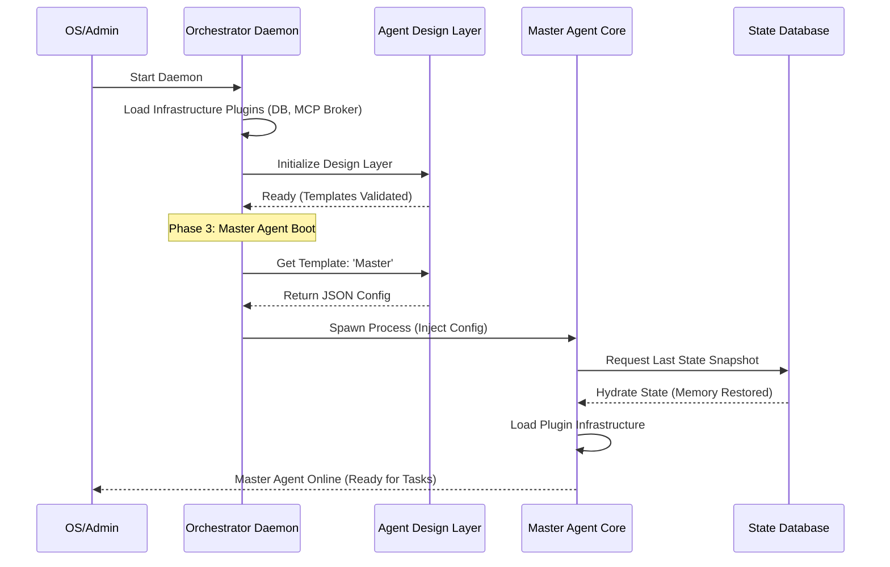

# 13. 系統啟動順序與引導邏輯 (System Boot Sequence)

本文件定義了 OpenStarry 系統中「守護層 (Daemon)」、「設計層 (Design Layer)」與「核心層 (Agent Core)」在冷啟動與運行時的加載順序與依賴關係。

## 核心依賴鏈

系統的啟動必須遵循以下邏輯鏈條：
**物理環境就緒 -> 守護進程管理啟動 -> 獲取代理人藍圖 (模板) -> 孵化代理人實體 -> 恢復歷史狀態。**

---

## 啟動階段詳解

### 階段一：守護層啟動 (Daemon Layer Boot)
這是系統的「上帝進程」啟動階段。

1.  **Orchestrator Daemon 啟動**: 由作業系統 (如 systemd 或服務腳本) 啟動 Daemon 行程。
2.  **加載基礎設施插件**: Daemon 根據配置，加載並啟動「基礎設施插件 (Infrastructure Plugins)」。這可能包含啟動本地的 MCP 消息代理 (Broker) 或初始化狀態資料庫服務 (State DB Service)。Daemon 本身不硬編碼特定的中間件邏輯。
3.  **狀態檢查**: Daemon 掃描之前的執行日誌，檢查是否有異常中斷需要恢復。

### 階段二：設計層就緒 (Design Layer Ready)
在創造任何代理人之前，必須先準備好它們的「基因庫」。

1.  **Agent Design Layer 服務上線**: 啟動設計層 API 服務（或初始化本地模板目錄）。
2.  **模板驗證**: 掃描所有代理人模板 (Agent Templates)，驗證 JSON 格式與工具定義的合法性。
3.  **提供查詢接口**: 準備好響應來自 Daemon 的配置查詢請求 (例如 `GET /templates/master-agent`)。

### 階段三：主代理人引導 (Master Agent Bootstrapping)
這是系統產生第一個智能實體的過程。

1.  **獲取藍圖**: Daemon 向設計層請求「主代理人 (Master Agent)」的詳細配置。
2.  **孵化行程 (Spawn)**: Daemon 根據配置，創建一個新的 OS 行程來運行 **Agent Core**。
3.  **核心自我初始化**:
    *   **加載基礎設施**: Agent Core 初始化內部的插件加載器。
    *   **恢復記憶**: Core 透過 Daemon 提供的接口，從狀態資料庫中讀取最後一次的 `State Snapshot`（如果存在）。
    *   **加載監聽器 (Listeners)**: 啟動 UI 或 Webhook 插件，正式開始與外界通信。

### 階段四：工作代理人按需創建 (Worker Agents on Demand)
系統進入運行時，根據任務需求動態擴張。

1.  **決策委派**: 主代理人 (Master Agent) 判斷任務需要協作，調用 `AgentManagerTool`。
2.  **請求孵化**: `AgentManagerTool` 向 Daemon 發送創建請求。
3.  **獲取 Worker 藍圖**: Daemon 向設計層請求對應 Worker 模板。
4.  **行程孵化**: Daemon 創建 Worker Agent 行程，並重複階段三的初始化流程（但通常更輕量級）。

5.  **執行 Core Loop：** 調用 `Core.start()`。

---

## 3. 內核引導機制：宿主引導模式 (Host Bootstrapping Pattern)

為了解決「純淨內核」無法自行讀取配置的悖論，我們採用宿主引導模式。

### 角色分工 (The Division of Labor)

*   **Host (宿主/協調層):** 
    *   **環境：** 具備原生 OS 權限的 Node.js 進程。
    *   **任務：** 讀取 `agent.json`、掃描硬碟目錄、物理加載 (`require/import`) 插件代碼。
*   **Core (內核):** 
    *   **環境：** 絕對純淨的邏輯容器。
    *   **任務：** 接收 Host 餵入的插件模組，執行初始化，啟動思考。

### 引導序列 (The Micro Sequence)

1.  **Host 甦醒：** 執行 `openstarry start`，Host 進程啟動。
2.  **Host 備料：** Host 根據配置檔，將所需的插件從硬碟「抓取」進內存記憶體。
3.  **靈魂注入：** Host 創建 `AgentCore` 實例，並將「已抓取的能力」傳入。
4.  **Core 運轉：** Core 發現自己已被賦予能力，開始執行任務。

**這確保了內核的跨平台性——只要宿主能提供對應的能力插件，內核可以在任何環境運行。**

---

## 關鍵規則

*   **唯一性**: 在同一時間，同一個 ID 的代理人只能有一個活動行程由 Daemon 管理。
*   **配置不可變性**: 代理人啟動後，其核心配置（藍圖）在該生命週期內不可更改，若要更新配置，必須重啟行程。
*   **降級啟動**: 如果設計層服務不可用，Daemon 應嘗試加載本地緩存的模板以維持基本運行。
