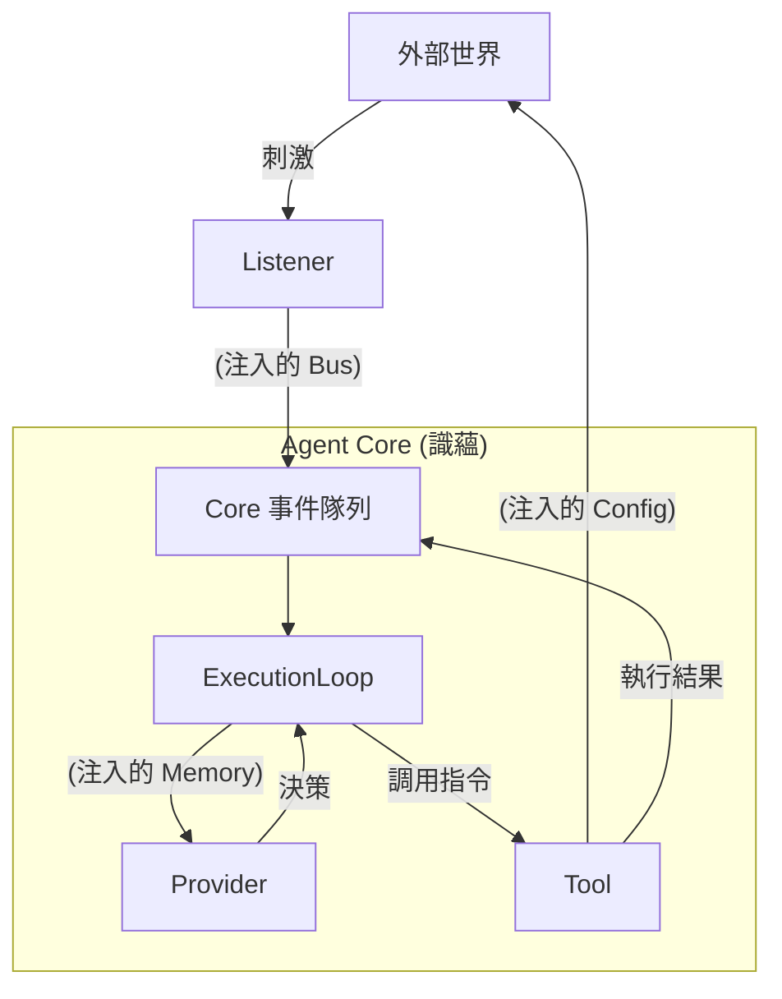

# 20. 依賴編織與控制迴路 (Dependency Wiring & Control Loop)

本文件深入探討 **協調層 (Coordination Layer)** 如何透過精密的 **依賴注入 (Dependency Injection)** 機制，將孤立的五蘊插件編織成一個連續的、有生命力的控制迴路。

## 1. 核心概念：從零件到有機體

一個 Agent 就像一個精密儀器。
*   **插件 (Plugins)** 是散落的零件（齒輪、馬達、感測器）。
*   **Core (識蘊)** 是機殼與主軸。
*   **依賴注入** 則是將這些零件安裝到正確位置並鎖緊螺絲的過程。

如果沒有正確的注入，Listener 聽到了聲音卻無法傳遞給大腦，Provider 想出了對策卻無法驅動手腳。

---

## 2. 協調層的編織任務 (The Wiring Tasks)

當 Agent 啟動時，協調層（或由其委派的 Loader）執行以下「編織」動作：

### A. 感知迴路的接合 (Wiring the Senses)
*   **對象：** `Listener` (受)
*   **注入物：** `EventBus` (事件匯流排)
*   **目的：** 確保外界刺激能轉化為 Core 內部的 `Input Event`。
*   **邏輯：**
    ```typescript
    // Loader 偽代碼
    listener.initialize({
      // 注入一個回調函數，讓 Listener 可以觸發 Core 的神經衝動
      emitInput: (data) => core.eventQueue.push(data)
    });
    ```

### B. 認知迴路的接合 (Wiring the Mind)
*   **對象：** `Provider` (想)
*   **注入物：** `Memory` (記憶體) & `Context`
*   **目的：** 確保思考具有連續性與上下文。
*   **邏輯：** Provider 本身不持有狀態，它依賴 Core 注入的 `context.memory` 來回溯過往對話。

### C. 行動迴路的接合 (Wiring the Limbs)
*   **對象：** `Tool` (行)
*   **注入物：** `Config` (配置與權限) & `Logger`
*   **目的：** 確保行動是獲得授權的，且結果可被追蹤。
*   **邏輯：**
    ```typescript
    tool.initialize({
      config: { apiKey: "...", rootDir: "/safe/path" }, // 安全邊界注入
      logger: core.logger.child({ scope: "Tool:FS" })   // 監控注入
    });
    ```

### D. 跨插件服務的接合 (Wiring Cross-Plugin Services)
*   **對象：** 依賴於其他插件的 Composite Plugin (如 Workflow)。
*   **注入物：** `dependencies` 物件。
*   **邏輯：**
    *   協調層先初始化 `SkillPlugin`，獲取其 `MarkdownParser` 實例。
    *   在初始化 `WorkflowPlugin` 時，將該實例注入 `context.dependencies['standard-function-skill']`。
    *   這確保了功能模組之間的**水平協作**。

---

## 3. 形成的控制迴路 (The Resulting Loop)

經過上述編織，一個標準的 OODA (Observe-Orient-Decide-Act) 迴路就形成了：



## 4. 斷鏈與診斷 (Troubleshooting Broken Loops)

協調層還負責監控迴路的完整性。如果在啟動檢查時發現：
*   **有 Listener 沒 Provider:** 這是「植物人」狀態（能聽不能想），發出警告。
*   **有 Provider 沒 Listener:** 這是「缸中之腦」狀態（能想但沒輸入），除非是純任務型 Agent，否則視為配置錯誤。
*   **Tool 需要 Config 但注入為空:** 這是「癱瘓」狀態，啟動失敗。

## 5. 總結

依賴注入不只是一種程式寫法，它是 **Agent 的神經外科手術**。協調層通過精準的注入，確保了五蘊皆空（組件解耦）的同時，又能五蘊熾盛（功能協同），讓 Agent 成為一個活著的有機體。
