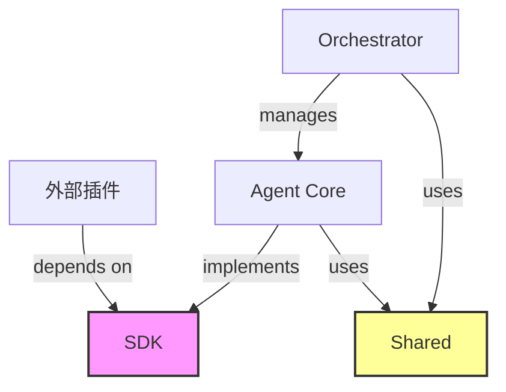

# 03. SDK 與共享庫結構規範 (Shared Libraries & SDK Structure)

本文件定義了 `packages/sdk` 與 `packages/shared` 的內部結構與職責。這兩個庫是 OpenStarry 生態系的基石，確保了核心 (Core) 與插件 (Plugins) 之間的解耦。

## 1. `packages/sdk` (The Public Contract)

**定位：** 這是 OpenStarry 對外暴露的「法律契約」。
**原則：**
*   **零依賴 (Zero Dependencies):** SDK 不應依賴任何運行時邏輯，只包含 Type 定義、抽象類別 (Abstract Classes) 和 輕量級 DTO。
*   **插件開發者必備:** 任何第三方插件開發者只需安裝 `@openstarry/sdk` 即可開發，無需安裝 Core。

### 目錄結構

```text
sdk/
├── src/
│   ├── types/              # 純 TypeScript 類型定義
│   │   ├── agent.ts        # IAgent, IAgentConfig
│   │   ├── message.ts      # IMessage, Role
│   │   ├── tool.ts         # ITool, ToolCallRequest
│   │   └── plugin.ts       # IPlugin, IPluginContext
│   ├── interfaces/         # 核心組件的行為接口
│   │   ├── llm.ts          # ILanguageModelProvider
│   │   └── storage.ts      # IVectorStore, IKeyValueStore
│   ├── errors/             # 標準錯誤定義 (確保錯誤類型統一)
│   │   └── base.ts         # AgentError, ToolExecutionError
│   └── index.ts            # 統一導出
└── package.json
```

### 關鍵類型定義示例

我們使用 TypeScript Interface 來定義「契約」：

```typescript
// 插件必須實現的接口
export interface IPlugin {
  id: string;
  name: string;
  version: string;
  initialize(context: IPluginContext): Promise<void>;
  shutdown(): Promise<void>;
}

// 核心傳遞給插件的上下文 (受限權限)
export interface IPluginContext {
  logger: ILogger;
  config: Record<string, any>;
  registerTool(tool: ITool): void;
  registerListener(listener: IListener): void;
}
```

---

## 2. `packages/shared` (Common Utilities)

**定位：** 這是系統內部的「工具箱」，供 `packages/core` 和 `apps/daemon` 共用。
**原則：**
*   **無狀態 (Stateless):** 這裡的函數應該是純函數 (Pure Functions)。
*   **跨平台:** 代碼應能在 Node.js 和 Browser 環境中運行 (儘量避免依賴 `fs`, `net` 等特定模組，或將其封裝)。

### 目錄結構

```text
shared/
├── src/
│   ├── logger/             # 結構化日誌封裝 (Pino/Winston Wrapper)
│   ├── utils/              # 通用工具函數
│   │   ├── uuid.ts         # ID 生成器
│   │   ├── sleep.ts        # 異步等待
│   │   └── validation.ts   # Zod/Joi schema 驗證輔助
│   ├── constants/          # 系統級常量
│   │   └── events.ts       # 核心事件名稱定義 (Event Topics)
│   └── index.ts
└── package.json
```

---

## 3. 依賴關係圖 (Dependency Graph)

這張圖展示了這兩個包在架構中的位置：



*   **SDK** 是最底層，最穩定的。
*   **Shared** 是中間層，提供便利性。
*   **Core** 是實作層，依賴上述兩者。
