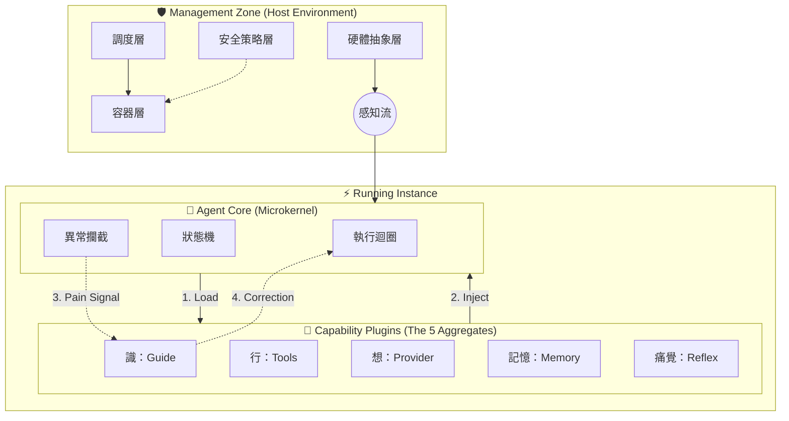

# OpenStarry: The Agent Operating System

**OpenStarry** 是一個重新定義智能代理人 (AI Agent) 構建方式的核心架構。它參考了現代操作系統的設計哲學，融合東方「五蘊」思想，旨在打造一個高度模組化、安全、且具備擬人化生命特徵的代理人協調層。

我們不只構建 Chatbot，我們構建的是**數位物種的操作系統**。

---

## 🏗️ 系統宏觀架構 (Macro-System Architecture)

OpenStarry 採用三層遞進的架構設計，模擬生物與其生存環境的共生關係：

### 1. Agent 協調管理層 (Management Zone)
**定位：系統的宿主環境 (Host) 與行政中樞。**
負責提供土壤與養分。這一層確保環境的穩定與安全，包含容器隔離 (Plumbing)、基於因果鏈的事件調度 (Orchestration)、安全戒律 (Policy) 以及硬體抽象層 (HAL)。它將物理世界的訊號轉換為 Agent 可理解的數據流。

### 2. Agent Core (Autonomous Life Zone)
**定位：純粹的「五蘊」計算循環。**
它是「無頭 (Headless)」且「無狀態 (Stateless)」的生命內核。唯一的職責是維持「受、想、行、識」的計算循環。Core 本質上是空的，它在不同的插件加持下展現出不同的生命樣態。

### 3. 能力插件層 (Capability Plugins)
**定位：賦予 Agent 個性、專業與靈魂的功能組件。**
插件決定了 Agent 的能力邊界。包括通訊協議 (Protocol)、自我反思 (Reflection) 與狀態記憶 (Memory) 插件。這讓同一個 Core 可以隨時從「程式碼專家」轉化為「設備監控員」。

---

## 🔄 因果生命週期 (The Lifecycle)

在 OpenStarry 中，一個任務的執行被視為一次生命的起滅：
1. **緣起 (Origination)**：環境層偵測到需求。
2. **調度 (Scheduling)**：管理層根據需求匹配所需的插件。
3. **生起 (Arising)**：容器層載入核心並動態注入能力。
4. **運行 (Operation)**：核心處理「痛覺」，達成目標。
5. **寂滅 (Cessation)**：任務完成，經驗存回記憶，實例隨之銷毀。



---

## 💻 核心配置範例 (The Shape of an Agent)

OpenStarry 的強大在於其聲明式的配置。以下是一個具備「痛覺」與「檔案操作能力」的標準 Agent 定義：

```jsonc
// agent.json
{
  "identity": { "id": "dev-bot-01", "name": "Resilient Developer" },
  "plugins": [
    // [想] 大腦：注入認知引擎
    { "name": "@openstarry-plugin/provider-gemini" },
    
    // [行] 手腳：注入檔案系統操作能力
    { "name": "@openstarry-plugin/standard-function-fs" },
    
    // [受] 感官：監聽終端機輸入
    { "name": "@openstarry-plugin/standard-function-stdio" },
    
    // [識] 靈魂：注入痛覺機制 (定義如何面對錯誤)
    { "name": "@openstarry-plugin/guide-pain-mechanism" }
  ],
  "policy": {
    // 管理層戒律：連續犯錯 3 次即觸發物理熔斷
    "safety": { "max_consecutive_errors": 3 } 
  }
}
```

---

## 🌟 十大核心宣言 (The Ten Tenets)

### 1. 代理人即操作系統進程 (Agent as OS Process)
Agent 不是一次性的腳本，而是具備持久生命週期、可被守護進程 (Daemon) 管理、監控、重啟的數位實體。它有自己的 PID，有自己的狀態，就像一個活著的進程。

### 2. 一切皆插件 (Everything is a Plugin)
系統的每一個器官都是可替換的。工具是插件，監聽器是插件，LLM 大腦是插件，甚至記憶策略和通訊協議也是插件。Core 只是一個空的插座板，所有能力都來自外部掛載。

### 3. 五蘊聚合架構 (Five Aggregates Architecture)
系統設計深度融合東方哲學。**Core 本質上是「空 (Sunyata)」的容器。** 它的生命特徵完全由五種插件（五蘊）賦予：
*   **色 (UI)**、**受 (Listener)**、**想 (Provider)**、**行 (Tool)**。
*   **識 (Guide):** 這是最關鍵的組件。是 Guide Plugin 注入了記憶與人設，賦予了 Core 「自我意識 (Vijnana)」。沒有 Guide，Core 只是無意識的運算力。

### 4. 目錄結構即協議 (Directory as Protocol)
無論是系統還是專案，無論是本地硬碟還是 USB 設備，只要目錄結構符合 `plugins/`, `configs/` 的標準規範，系統即可自動識別並加載。物理結構直接映射了運行時邏輯。

### 5. 目錄結構即權限 (Directory as Permission)
系統層與專案層採用同構設計，但權限嚴格隔離。插件的放置位置決定了其可見性範圍；Agent 的運行位置決定了其權限邊界。系統管理員無法直接染指業務插件，確保了安全隔離。

### 6. 擬人化的認知流與痛覺 (Anthropomorphic Cognitive Flow & Pain)
錯誤被轉化為 Agent 的「痛覺 (Negative Feedback)」。系統內置反饋迴路，將運行時錯誤注入 Context，迫使 Agent 在失敗中自我反思與修正，模擬生物的試錯學習過程。

### 7. 微內核與絕對純淨 (Microkernel & Absolute Purity)
Agent Core 採用嚴格的**微內核架構 (Microkernel Architecture)**。
*   **物理隔離:** 編譯後的 Core 二進制檔**嚴禁包含任何插件代碼**。
*   **絕對純淨:** Core 只依賴於抽象介面 (SDK)，本身不具備任何具體能力。所有能力都必須在運行時通過外部插件動態注入。
*   **無頭設計 (Headless):** 內核是去中心化的，不依賴任何特定的 UI 或 IO 設備。這保證了 Agent 的「靈魂」可以移植到任何「軀殼」中——從 CLI 到 Web，從 Docker 到 IoT 設備。
*   **意義:** 沒有內置代碼，就沒有內置 Bug。

### 8. 控制理論閉環模型 (Control-Theoretic Loop Model)
不僅是執行迴圈，更是控制迴圈。系統將用戶目標視為參考輸入，將 Context 視為狀態反饋，將 Tool Call 視為控制變量。Agent 的本質是一個不斷最小化「目標與現狀誤差」的智能控制器。

### 9. 可插拔的記憶策略 (Pluggable Context Strategy)
記憶管理不再是硬編碼的邏輯。開發者可以根據 Agent 的角色需求，動態更換記憶策略（滑動窗口、動態摘要、狀態提取），靈活平衡成本與記憶深度。

### 10. 分形社會結構 (Fractal Social Structure)
系統具有自相似性。一個複雜的 Agent 可以由多個子 Agent 組成，對外暴露統一的 MCP 接口。這種分形設計允許我們構建無限層級的協作網絡，實現「由一而生萬物」的數位社會。

---

## 📚 文檔導航地圖 (Documentation Map)

### 1. 系統架構文檔 (Architecture Documentation)
*定義系統的願景、角色與宏觀啟動流程。*
* [00_設計哲學 (OpenStarry Design Philosophy)](./Architecture_Documentation/00_OpenStarry_Design_Philosophy.md)
* [01_架構概覽 (Architecture Overview)](./Architecture_Documentation/01_Architecture_Overview.md)
* [02_無頭代理核心 (Headless Agent Core)](./Architecture_Documentation/02_Headless_Agent_Core.md)
* [03_代理設計與模板服務 (Agent Design & Template Service)](./Architecture_Documentation/03_Agent_Design_and_Template_Service.md)
* [04_插件基礎設施 (Plugin Infrastructure)](./Architecture_Documentation/04_Plugin_Infrastructure.md)
* [05_Linux 設計原則啟發 (Linux Design Principles Inspiration)](./Architecture_Documentation/05_Linux_Design_Principles_Inspiration.md)
* [06_插件介面範例 (Plugin Interface Examples)](./Architecture_Documentation/06_Plugin_Interface_Examples.md)
* [07_支持引擎生態系 (Supporting Engines Ecosystem)](./Architecture_Documentation/07_Supporting_Engines_Ecosystem.md)
* [08_命令與工具設計 (Command & Tool Design)](./Architecture_Documentation/08_Command_And_Tool_Design.md)
* [09_通訊協議策略 (Communication Protocol Strategy)](./Architecture_Documentation/09_Communication_Protocol_Strategy.md)
* [10_引導與插件載入 (Bootstrapping & Plugin Loading)](./Architecture_Documentation/10_Bootstrapping_And_Plugin_Loading.md)
* [11_代理管理工具設計 (Agent Manager Tool Design)](./Architecture_Documentation/11_Agent_Manager_Tool_Design.md)
* [12_工作流引擎工具設計 (Workflow Engine Tool Design)](./Architecture_Documentation/12_Workflow_Engine_Tool_Design.md)
* [13_編排守護進程設計 (Orchestrator Daemon Design)](./Architecture_Documentation/13_Orchestrator_Daemon_Design.md)
* [14_系統啟動序列 (System Boot Sequence)](./Architecture_Documentation/14_System_Boot_Sequence.md)
* [15_啟動與任務流 (System Startup & Task Flow)](./Architecture_Documentation/15_System_Startup_and_Task_Flow.md)
* [16_插件類型哲學映射 (Plugin Types Philosophical Mapping)](./Architecture_Documentation/16_Plugin_Types_Philosophical_Mapping.md)
* [17_宿主引導模式 (Host Bootstrapping Pattern)](./Architecture_Documentation/17_Host_Bootstrapping_Pattern.md)
* [18_插件載入協議 (Plugin Loading Protocol)](./Architecture_Documentation/18_Plugin_Loading_Protocol.md)
* [19_代理協調層 (Agent Coordination Layer)](./Architecture_Documentation/19_Agent_Coordination_Layer.md)
* [20_依賴編織與控制迴路 (Dependency Wiring & Control Loop)](./Architecture_Documentation/20_Dependency_Injection_and_Control_Loop.md)
* [21_插件介面深度解析 (Plugin Interface Deep Dive)](./Architecture_Documentation/21_Plugin_Interface_Deep_Dive.md)
* [22_代理人協調層：歸一化與適配 (Agent Coordination Layer: Normalization)](./Architecture_Documentation/22_Agent_Coordination_Layer_Normalization.md)
* [23_動態插件載入與命名 (Dynamic Plugin Loading & Naming)](./Architecture_Documentation/23_Dynamic_Plugin_Loading_and_Naming.md)
* [24_Runner 架構 (Runner Architecture)](./Architecture_Documentation/24_Runner_Architecture.md)
* [25_PushInput 事件架構 (PushInput Event Architecture)](./Architecture_Documentation/25_PushInput_Event_Architecture.md)
* [26_插件服務與生命週期管理 (Plugin Service & Lifecycle Management)](./Architecture_Documentation/26_Plugin_Service_And_Lifecycle_Management.md)
* [27_系統拓樸與管理層架構 (System Topology & Management Zone)](./Architecture_Documentation/27_System_Topology_and_Management_Zone.md)

### 2. 核心組件深潛 (Agent Core Components Deep Dive)
*深入內核，研究具體技術機制與理論模型。*
* [00_核心哲學 (Core Philosophy)](./Agent_Core_Components_Deep_Dive/00_Core_Philosophy.md)
* [01_執行迴圈 (Execution Loop)](./Agent_Core_Components_Deep_Dive/01_Execution_Loop.md)
* [02_通訊介面 (Communication Interface)](./Agent_Core_Components_Deep_Dive/02_Communication_Interface.md)
* [03_安全層 (Security Layer)](./Agent_Core_Components_Deep_Dive/03_Security_Layer.md)
* [04_狀態管理器 (State Manager)](./Agent_Core_Components_Deep_Dive/04_State_Manager.md)
* [05_插件基礎設施整合 (Plugin Infrastructure Integration)](./Agent_Core_Components_Deep_Dive/05_Plugin_Infrastructure_Integration.md)
* [06_狀態持久化機制 (State Persistence Mechanism)](./Agent_Core_Components_Deep_Dive/06_State_Persistence_Mechanism.md)
* [07_安全斷路器 (Safety Circuit Breakers)](./Agent_Core_Components_Deep_Dive/07_Safety_Circuit_Breakers.md)
* [08_安全實作 (Safety Implementation)](./Agent_Core_Components_Deep_Dive/08_Safety_Implementation.md)
* [09_可觀測性與追蹤 (Observability and Tracing)](./Agent_Core_Components_Deep_Dive/09_Observability_and_Tracing.md)
* [10_上下文管理策略 (Context Management Strategy)](./Agent_Core_Components_Deep_Dive/10_Context_Management_Strategy.md)
* [11_插件運行時隔離 (Plugin Runtime Isolation)](./Agent_Core_Components_Deep_Dive/11_Plugin_Runtime_Isolation.md)
* [12_錯誤處理與自我修正 (Error Handling & Self Correction)](./Agent_Core_Components_Deep_Dive/12_Error_Handling_and_Self_Correction.md)
* [13_代理核心作為控制系統 (Agent Core as Control System)](./Agent_Core_Components_Deep_Dive/13_Agent_Core_as_Control_System.md)
* [14_代理核心哲學：五蘊 (Agent Core Philosophy: Five Aggregates)](./Agent_Core_Components_Deep_Dive/14_Agent_Core_Philosophy_Five_Aggregates.md)
* [16_OpenStarry 標準協議 (OpenStarry Standard Protocol)](./Agent_Core_Components_Deep_Dive/16_OpenStarry_Standard_Protocol.md)

### 3. 專案結構與規範 (Project Structure and Conventions)
*定義物理佈局、源碼組織、開發流程與安裝規範。*
* [00_路線圖與里程碑 (Roadmap & Milestones)](./Project_Structure_and_Conventions/00_Roadmap_and_Milestones.md)
* [01_Monorepo 頂層結構 (Monorepo Top Level Structure)](./Project_Structure_and_Conventions/01_Monorepo_Top_Level_Structure.md)
* [02_核心源碼結構 (Core Source Code Structure)](./Project_Structure_and_Conventions/02_Core_Source_Code_Structure.md)
* [03_共享組件與 SDK 結構 (Shared & SDK Structure)](./Project_Structure_and_Conventions/03_Shared_and_SDK_Structure.md)
* [04_標準代理目錄解剖 (Standard Agent Directory Anatomy)](./Project_Structure_and_Conventions/04_Standard_Agent_Directory_Anatomy.md)
* [05_代理清單規範 (Agent Manifest Specification)](./Project_Structure_and_Conventions/05_Agent_Manifest_Specification.md)
* [06_插件目錄慣例 (Plugin Directory Conventions)](./Project_Structure_and_Conventions/06_Plugin_Directory_Conventions.md)
* [07_編碼與測試標準 (Coding & Testing Standards)](./Project_Structure_and_Conventions/07_Coding_and_Testing_Standards.md)
* [08_系統與專案運行時佈局 (System & Project Runtime Layouts)](./Project_Structure_and_Conventions/08_System_and_Project_Runtime_Layouts.md)
* [09_CLI 設計與管理命令 (CLI Design & Management Commands)](./Project_Structure_and_Conventions/09_CLI_Design_and_Management_Commands.md)
* [10_構建與發佈策略 (Build & Distribution Strategy)](./Project_Structure_and_Conventions/10_Build_and_Distribution_Strategy.md)
* [11_第三方插件安裝 (Third-Party Plugin Installation)](./Project_Structure_and_Conventions/11_Third_Party_Plugin_Installation.md)
* [12_能力注入機制 (Capabilities Injection Mechanism)](./Project_Structure_and_Conventions/12_Capabilities_Injection_Mechanism.md)
* [13_複合插件與依賴 (Composite Plugins & Dependencies)](./Project_Structure_and_Conventions/13_Composite_Plugins_and_Dependencies.md)
* [14_Markdown 技能規範 (Markdown Skill Specification)](./Project_Structure_and_Conventions/14_Markdown_Skill_Specification.md)

### 4. 插件基礎設施範例 (Plugin System Architecture)
*插件系統的具體應用、概念與規範。*
* [00_插件哲學：五蘊 (Plugin Philosophy: Five Aggregates)](./Plugin_System_Architecture/00_Plugin_Philosophy_Five_Aggregates.md)
* [01_MCP 插件範例 (MCP Plugin Example)](./Plugin_System_Architecture/01_MCP_Plugin_Example.md)
* [02_MCP 協議整合 (MCP Protocol Integration)](./Plugin_System_Architecture/02_MCP_Protocol_Integration.md)
* [03_開發者工具範例 (Developer Tools Example)](./Plugin_System_Architecture/03_Developer_Tools_Example.md)
* [04_網路交互範例 (Web Interaction Example)](./Plugin_System_Architecture/04_Web_Interaction_Example.md)
* [05_進階 UI 與設備範例 (Advanced UI & Device Example)](./Plugin_System_Architecture/05_Advanced_UI_And_Device_Example.md)
* [06_數據驗證範例 (Data Validation Example)](./Plugin_System_Architecture/06_Data_Validation_Example.md)

### 5. 實作範例與指南 (Implementation Examples)
*動手寫代碼，從案例學習實踐。*
* [上下文策略：滑動窗口 (Context Strategy: Sliding Window)](./Implementation_Examples/Context_Strategy_SlidingWindow.md)
* [開發者指南：獨立執行 (Developer Guide: Standalone Execution)](./Implementation_Examples/Developer_Guide_Standalone_Execution.md)
* [OpenClaw 協調層 (OpenClaw Coordination Layer)](./Implementation_Examples/openclaw_Coordination_Layer.md)
* [OpenClaw UI 頻道適配器 (OpenClaw UI Channel Adapters)](./Implementation_Examples/openclaw_UI_Channel_Adapters.md)
* [OpenCode 代碼解釋器套件 (OpenCode Code Interpreter Suite)](./Implementation_Examples/opencode_Code_Interpreter_Suite.md)
* [Provider: Gemini 範例](./Implementation_Examples/Provider_Gemini_Example.md)
* [Tool: 代碼解釋器範例](./Implementation_Examples/Tool_CodeInterpreter_Example.md)
* [Tool: 讀取檔案範例](./Implementation_Examples/Tool_ReadFile_Example.md)
* [Transport: WebSocket 插件](./Implementation_Examples/Transport_Plugin_Websocket.md)
* [UI 插件範例 (UI Plugin Example)](./Implementation_Examples/UI_Plugin_Example.md)
* [USB 即插即用代理場景 (USB Plug-and-Play Agent Scenario)](./Implementation_Examples/USB_Plug_and_Play_Agent_Scenario.md)
* [擬人化痛覺機制範例 (Pain Mechanism Demo)](./Implementation_Examples/Pain_Mechanism_Demo.md)


---

## 🛠️ 快速開始

準備好開始了嗎？請參閱 **[Developer_Guide_Standalone_Execution.md](./Implementation_Examples/Developer_Guide_Standalone_Execution.md)** 運行您的第一個 Agent。